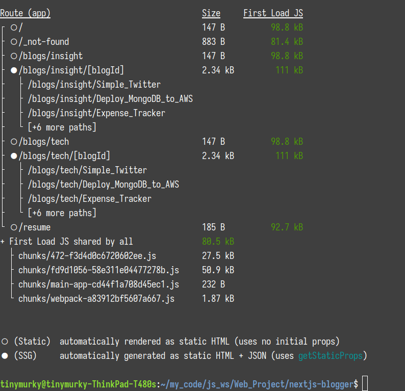

# Nextjs Blogger
這是我個人的部落格專案，使用Nextjs開發

## Live Demo
[Tiny_Murky's Bloggger 部署於Vercer](https://nextjs-blogger-tiny-murkys-projects.vercel.app/)

## 目錄
- [功能](#功能)
- [安裝專案](#安裝專案)
- [新增文章](#新增文章)
- [使用工具](#使用工具)
- [參考網站](#參考網站)
- [功能展示](#功能展示)
## 功能
- 部落格本文
    - 將markdown 部落格文章轉為html呈現
    - 部落格右側有動態目錄，高亮顯示目前章節，且可點擊滑動至目標章節
    - 各章節標題實做anchor tag，分享網址更方便
    - 部落格code block 實做複製功能
    - 部落格下方加入第三方套件giscus，實做留言板功能
    - 部落格圖片實做placeholder。載入時會先載入模糊圖片，之後才載入一般圖片
- 其他功能
    - 部落格依照心得與技術文章區分不同Router
    - 部落格瀏覽頁可依照標題和文章的tag(我幫文章加的屬性標籤)搜尋文章
    - 所有頁面皆為static 或是  server side generation(SSG)讀取更快速
    - 實做RWD，手機也可輕鬆閱覽

## 安裝專案
1. 請先確認有安裝 node.js 、 npm 與 mySQL
2. 將專案 clone 至本地
    ```shell
    git clone https://github.com/TinyMurky/nextjs-blogger.git
    ```
3. 在本地開啟後，透過終端機進入資料夾，輸入 :
    ```shell
    npm install
    ```
4. 安裝完成後可以輸入以下指令進入develop模式:
    ```shell
    npm run dev
    ```
5. 於瀏覽器輸入以下指令進入網頁，develop模式中畫面會即時編譯所以會比較慢一些
    ```url
    localhost:3000
    ```
6. 您可以對此專案進行修改，修改完後輸入以下指令，nextjs會產生production版本網站
    ```shell
    npm run build
    ```
7. 最後輸入以下指令並進入`localhost:3000`，使用production版本網站，您會發現速度比develop網站還要快

## 新增文章
本專案有`/blogs/insight`(心得文章)與`/blogs/tech`(技術文章)兩支路由。若想於其中新增新的文章請按照以下步驟

- 請於`/nextjs-blogger/public/blogs/insight`或是`/nextjs-blogger/public/blogs/tech`資料夾中新增一個新的資料夾，資料夾名稱建議全英文並以下底限`_`取代空格，資料夾名稱會作為Route最後段的id使用
- 於資料夾內部新增與資料夾**同名** 副檔名是`.mdx`的檔案，這是文章主要位置。並須另外新增`images`資料夾可以放圖片
    ```
    /tech
        |_ Example
              |_ Example.mdx
                 images
    ```

- 請於mdx中使用mardown語法開始撰寫文章，於文章最上頭請擺放以下資料，上下端的`___`都需要加入
    ```markdown
    ---
    title: 請輸入文字，會呈現於部落格瀏覽頁、部落格內文標題並用於搜尋
    description: 請輸入文字，會呈現於部落格瀏覽頁
    date: 格式請依照'2023-03-09'，用於計算部落格擺放順序
    tag: 請輸入文字，會呈現於部落格瀏覽頁並用於搜尋
    readTime: 請輸入數字，代表此文章需要的閱讀時間
    cover: './images/放您的部落格封面.png'
    slug: 無作用，從medium 下載的文章的slug可以放至於此
    ---
    ```
- 本專案圖片實做相對路徑，請將文章中使用的圖片放至於同移資料夾中的`images`中，於markdown中使用以下方法新增圖片，檔名除了一般的jpg、png、gif...外，也可使用avif與webp
    ```
        
    ```
- 嵌入影片時請使用`<iframe>`，但請刪除裡面的`width`與`height`，本專案已依照螢幕寬度設定影片的RWD。
    ex: youtube的內嵌影片
    ```html
    <iframe  src="https://www.youtube.com/embed/dQw4w9WgXcQ?si=L3lpHPHLbj17uvfB&amp;controls=0" title="YouTube video player" frameborder="0" allow="accelerometer; autoplay; clipboard-write; encrypted-media; gyroscope; picture-in-picture; web-share" allowfullscreen></iframe>
    ```

## 使用工具

- next.js 13.5.5
- react 18
- react-dom 18
- typescript 5
- tailwindcss 3
- tailwindcss/typography 0.5.10
- vercel(部署網站)
- next-contentlayer 0.3.4 （mdx轉rehype)
- rehype-prism-plus 1.6.3 (將code block上色)
- rehype-slug 6.0.0 (幫各章節標題增加id)
- github-slugger 2.0.0 (可獨立運算出與rehype-slug相同的id)
- sharp 0.32.6 (將大圖片轉成網站用的小圖片)
- unist-util-visit: 5.0.0
- @giscus/react 2.3.0 (聊天室套件)
- clsx 2.0.0 (合併className, 用於tailwind)
- date-fns 2.30.0 (date format)
- image-size 1.0.2 (抓取圖片的長寬)
- plaiceholder 3.0.0 (製作圖片在如前的模糊圖片)
- react-icons 4.11.0 (一些漂亮的圖案)

## 參考網站
謝謝Eason 和 David兩位大神提供的超強教學
- [總結與回顧：一個炫砲技術部落格的誕生 - Modern Next.js Blog 系列 #30](https://easonchang.com/posts/modern-nextjs-blog-summary)
- [Next.js Blog Website | How to Build a Blog App with Nextjs 13](https://www.youtube.com/watch?v=puIQhnjOfbc)

## 功能展示

可於`/`、`/blogs/insigh`、`/blogs/tech`瀏覽所有部落格或分類


可於搜尋欄搜尋部落格標題與tag


部落格畫面展示


目錄會高亮螢幕中出現最上方的h3標題，也可以點擊滑到該標題


可以使用gihub帳戶留言


點選標題旁邊的anchor tag，url會增加`#+標題`，並將該標題至於最上方


code block可使用複製功能


另外有我的履歷頁面


實做rwd，手機也可以輕鬆使用


所有頁面皆是static與SSG
