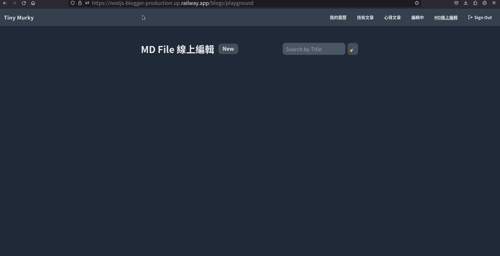
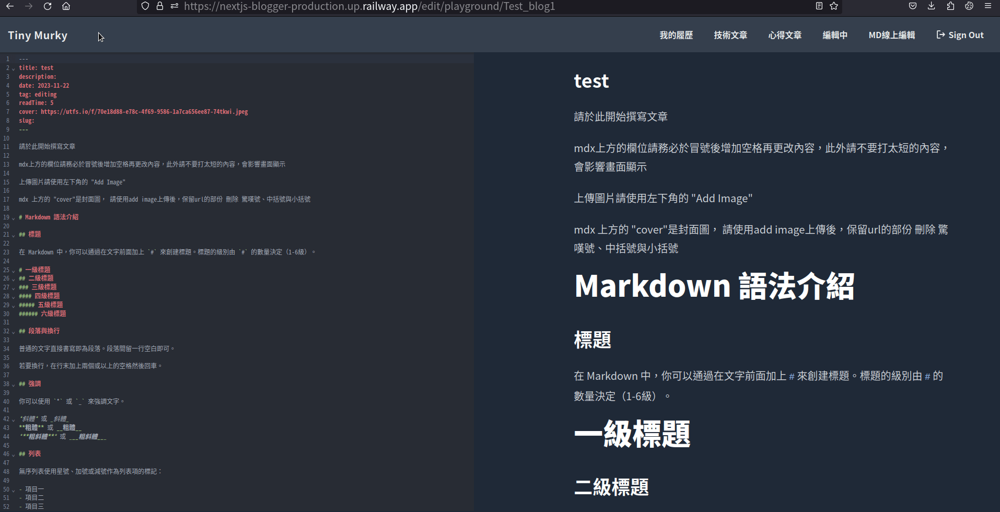

# Nextjs Blogger
這是我個人的部落格專案，使用Nextjs開發

## Live Demo
[Tiny_Murky's Bloggger 部署於Railway](https://nextjs-blogger-production.up.railway.app)


## 目錄
- [功能](#功能)
- [安裝專案](#安裝專案)
    - [設定`.env.local`](#設定envlocal)
- [新增文章](#新增文章)
- [使用工具](#使用工具)
- [參考網站](#參考網站)
- [功能展示](#功能展示)
## 功能
- 部落格本文
    - 將markdown 部落格文章轉為html呈現
    - 部落格右側有動態目錄，高亮顯示目前章節，且可點擊滑動至目標章節
    - 各章節標題實做anchor tag，分享網址更方便
    - 部落格code block 實做複製功能
    - 部落格下方加入第三方套件giscus，實做留言板功能
    - 部落格圖片實做placeholder。載入時會先載入模糊圖片，之後才載入一般圖片

- 瀏覽頁面功能
    - 部落格依照心得文章、技術文章、編輯中、MD線上編輯區分不同Router
    - 部落格瀏覽頁可依照標題和文章的tag(我幫文章加的屬性標籤)搜尋文章
    - 所有頁面皆為static 或是  server side generation(SSG)讀取更快速(`/api`不是)

- 登入功能
    - NextAuth實做Github登入，登入後開啟`/blogs/playground`（MD線上編輯）以外route的編輯功能，開放使用`/blogs/edit`(編輯中）route 的 `new`、`edit`與`publish`功能

- CRUD功能
    - 於`/blogs/edit`(編輯中，須登入)、`/blogs/playground`（MD線上編輯）route中有`new`按鈕可以新增一篇新的部落格
    - 於登入後每篇文章皆可編輯，點選部落格本文的`edit`按鈕進入`/edit/[categoryId]/[blogId]`route。直接使用`markdown`格式編輯文章。
    - 編輯頁面右下角的control pannel有以下三個按鍵
        - `Save`：儲存部落格的更改
        - `Finish`：儲存部落格更改，並離開頁面回到`/blogs/[categoryId]/[blogId]`
        - `Add Image`：將圖片上傳到雲端平台[uploadthing](https://uploadthing.com/)，並將url直接插入`markdown`檔
    - 在`/blogs/edit/[blogId]`頁面有`publish`按鈕，可將編輯中的部落格移轉至`/blogs/tech`(技術文章)或是`/blogs/insight`(心得文章)，此動作無法逆向。
    - 每篇部落格都設有`delete`按鈕可刪除，已上傳的圖檔**不會**刪除
    - 以上功能除了`publish`以外都可以在`/blogs/playground`（MD線上編輯）以未登入身份體驗
    - 所有文章皆有`download`按鈕，可下在該文章的`markdown`檔，文中所有在`uploadthings`上傳的圖片會配放在同一個壓縮檔的`./images`資料夾。下載的`markdown`檔案中所有`uploadthings`連結會被更改為相對路徑指向`./image`資料夾

- 其他功能
    - 實做RWD，手機也可輕鬆閱覽

## 安裝專案
1. 請先確認有安裝 node.js 、 npm 與 mySQL
2. 將專案 clone 至本地
    ```shell
    git clone https://github.com/TinyMurky/nextjs-blogger.git
    ```
3. 在本地開啟後，透過終端機進入資料夾，輸入 :
    ```shell
    npm install
    ```
4. 請依照[設定`.env.local`](#設定envlocal)章節填寫`.env.local`檔案
5. 如果要體驗登入功能，更改`/prisma/seed.ts`檔案第16行`where: { email: 'murky0830@gmail.com' },`改成您github帳號使用的email，目前email帳號只能從seeder新增或直接進資料庫修改
6. 建立資料庫
    - 輸入以下指令建立database
        ```bash
        npm run prisma:generate
        ```
    - 輸入以下指令建立table與seed(seed包含可於Github登入的帳號以及九篇預設部落格，且圖片會上傳`uploadthings`)
        ```bash
        npm run migrate:dev
        ```
    - 如果seeder在建立時意外中斷，輸入以下指令重起
        ```bash
        npm run db:seed
        ```
    - 如果想重跑一次輸入以下指令
        ```bash
        npm run migrate:reset
        ```
7. 安裝完成後可以輸入以下指令進入develop模式:
    ```shell
    npm run dev
    ```
8. 於瀏覽器輸入以下指令進入網頁，develop模式中畫面會即時編譯所以會比較慢一些
    ```url
    localhost:3000
    ```
9. 您可以對此專案進行修改，修改完後輸入以下指令，nextjs會產生production版本網站
    ```shell
    npm run build
    ```
10. 最後輸入以下指令並進入`localhost:3000`，使用production版本網站，您會發現速度比develop網站還要快

### 設定`.env.local`
1. 請先將`/.env.local.example`改名為`/.env.local`，裡面有13個環境變數需要填入
2. `NEXT_PUBLIC_GISCUS_REPO_ID`、`NEXT_PUBLIC_GISCUS_CATEGORY_ID`:
    - 您需要先將本專案fork到你的public github
    - [在Github安裝Giscus](https://github.com/apps/giscus)
    - 前往[Giscus](https://giscus.app/zh-TW)
    - 於儲存庫貼上你的public github，在分類選擇`Announcements`
        
    - 在啟動Giscus區塊中`data-repo-id`填入`NEXT_PUBLIC_GISCUS_REPO_ID`，  `data-category-id`填如`NEXT_PUBLIC_GISCUS_CATEGORY_ID`
        
3. `DATABASE_URL`:填入您的mysql連線網址，應該類似於右所述:`mysql://<mysql帳號>:<mysql密碼>@localhost:3306/nextjs_blog_db`
4. `UPLOADTHING_SECRET`、`UPLOADTHING_APP_ID`:
    - 前往[Uploadthings](https://uploadthing.com/)取得帳號
    - 創新的app
        
    - 前往`api key`中新增一筆secret key後將兩個值複製貼上
        
5. `NEXT_PUBLIC_API_URL`:這是NEXT本身要使用的URL，可填`http://localhost:3000`，如果您有部署再填部署網址
6. `NODE_ENV`:填寫development，部屬後請刪除此環境變數
7. `GITHUB_CLIENT_ID`, `GITHUB_CLIENT_SECRET`:
    - 請於 [Github register a new OAuth application](https://github.com/settings/applications/new) 申請一組Client ID與Client secrets
    - 申請時請於`Homepage URL`填寫`http://localhost:3000`，`Authorization callback URL` 填寫`http://localhost:3000/auth/github/callback/api/auth/callback/github`
    
8. `NEXTAUTH_SECRET`:輸入你喜歡的值，這用來作為NextAuth的secret word
9. `NEXTAUTH_URL`:這是登入失敗時會導回的URL，可填`http://localhost:3000`，如果您有部署再填部署網址
10. `DEFAULT_NEWBLOG_IMG`: 不一定要填，可以放一張在`uploadthings`的圖片，在新增部落格文章實惠作為default圖片出現在範例中

## 新增文章
本專案可在`/blogs/edit`(編輯中)與`/blogs/playground`(MD線上編輯)兩支route可以按下新增案件新增部落格文。若想於其中新增新的文章請按照以下步驟

- 請使用mardown語法開始撰寫文章，於文章最上頭請擺放以下資料，上下端的`___`都不可以刪除，新增時已經填好預設資料，可以自行更改。
    ```markdown
    ---
    title: 請輸入文字，會呈現於部落格瀏覽頁、部落格內文標題並用於搜尋
    description: 請輸入文字，會呈現於部落格瀏覽頁
    date: 格式請依照'2023-03-09'，用於計算部落格擺放順序
    tag: 請輸入文字，會呈現於部落格瀏覽頁並用於搜尋
    readTime: 請輸入數字，代表此文章需要的閱讀時間
    cover: './images/放您的部落格封面.png'
    slug: 無作用，從medium 下載的文章的slug可以放至於此
    ---
    ```
- 部落格圖片目前緊開放`uploadthings`的`https://utfs.io/f/`網域，請勿必使用內建的上傳圖片`Add Image`按鈕上傳
    ```
        
    ```
- 嵌入影片時請使用`<iframe>`，但請刪除裡面的`width`與`height`，本專案已依照螢幕寬度設定影片的RWD。
    ex: youtube的內嵌影片
    ```html
    <iframe  src="https://www.youtube.com/embed/dQw4w9WgXcQ?si=L3lpHPHLbj17uvfB&amp;controls=0" title="YouTube video player" frameborder="0" allow="accelerometer; autoplay; clipboard-write; encrypted-media; gyroscope; picture-in-picture; web-share" allowfullscreen></iframe>
    ```

## 主要使用工具（依照重要順序排列）

- next.js 14.0.3
- react 18
- react-dom 18
- typescript 5
- tailwindcss 3
- tailwindcss/typography 0.5.10
- railway(部署網站)
- prisma 5.5.2 (資料庫)
- codemirror 6.3.0 (實做線上寫md功能)
- mdx-bundler 9.2.1（mdx轉rehype)
- uploadthing 5.7.4 (上傳圖片)
- rehype-prism-plus 1.6.3 (將code block上色)
- rehype-slug 6.0.0 (幫各章節標題增加id)
- remark-gfm 3.0.0 (呈現table)
- rehype-react 8.0.0 (呈現table)
- github-slugger 2.0.0 (可獨立運算出與rehype-slug相同的id)
- sharp 0.32.6 (將大圖片轉成網站用的小圖片)
- unist-util-visit: 5.0.0
- @giscus/react 2.3.0 (聊天室套件)
- clsx 2.0.0 (合併className, 用於tailwind)
- date-fns 2.30.0 (date format)
- image-size 1.0.2 (抓取圖片的長寬)
- plaiceholder 3.0.0 (製作圖片在如前的模糊圖片)
- react-icons 4.11.0 (一些漂亮的圖案)
- jszip (壓縮文章與圖片，以供下載)
- sweetalert2 (漂亮的彈出視窗)

## 參考網站
謝謝Eason 和 David兩位大神提供的超強教學
- [總結與回顧：一個炫砲技術部落格的誕生 - Modern Next.js Blog 系列 #30](https://easonchang.com/posts/modern-nextjs-blog-summary)
- [Next.js Blog Website | How to Build a Blog App with Nextjs 13](https://www.youtube.com/watch?v=puIQhnjOfbc)

## 功能展示

### 部落格瀏覽頁面
可於`/`、`/blogs/insigh`、`/blogs/tech`瀏覽所有部落格或分類


可於搜尋欄搜尋部落格標題與tag


可使用github登入與登出


### 部落格本文畫面展示


目錄會高亮螢幕中出現最上方的h3標題，也可以點擊滑到該標題


可以使用gihub帳戶留言


點選標題旁邊的anchor tag，url會增加`#+標題`，並將該標題至於最上方


code block可使用複製功能


### CRUD功能展示
在`/blogs/edit`與`/blogs/playground`可以按`new`按鈕新增文章


可直接用`markdown`語法編輯


按`Add Image`可以新增圖片


按`Save`保存，按`Finish`結束編輯


按`edit`回到編輯頁面


按`download`可以把文章與圖片全部下載下來


按`delete`可以刪除文章


`/blogs/edit`的文章可以public到技術文章或心得文章，此結果不可逆


### 其他功能展示
另外有我的履歷頁面


實做rwd，手機也可以輕鬆使用


`/api`之外的頁面皆是static與SSG

```shell
> nextjs-blogger@0.1.0 build
> next build

   ▲ Next.js 14.0.3
   - Environments: .env.local

 ✓ Creating an optimized production build    
 ✓ Compiled successfully
   Skipping validation of types
 ✓ Linting    
 ✓ Collecting page data    
 ✓ Generating static pages (13/13) 
 ✓ Collecting build traces    
 ✓ Finalizing page optimization    

Route (app)                              Size     First Load JS
┌ ○ /                                    162 B           138 kB
├ ○ /_not-found                          879 B          86.5 kB
├ λ /api/auth/[...nextauth]              0 B                0 B
├ λ /api/blogs                           0 B                0 B
├ λ /api/blogs/[blogId]                  0 B                0 B
├ λ /api/blogs/[blogId]/download         0 B                0 B
├ λ /api/blogs/[blogId]/publish          0 B                0 B
├ λ /api/mdx/preview                     0 B                0 B
├ λ /api/uploadthing                     0 B                0 B
├ ● /blogs/[categoryId]                  162 B           138 kB
├   ├ /blogs/tech
├   ├ /blogs/insight
├   ├ /blogs/edit
├   └ /blogs/playground
├ ● /blogs/[categoryId]/[blogId]         15.8 kB         160 kB
├ ● /edit/[categoryId]/[blogId]          231 kB          342 kB
└ ○ /resume                              187 B          97.6 kB
+ First Load JS shared by all            85.7 kB
  ├ chunks/2472-06f436d700e38905.js      28.7 kB
  ├ chunks/fd9d1056-20c353a1e6f64284.js  53.3 kB
  ├ chunks/main-app-861169f836e962fd.js  222 B
  └ chunks/webpack-0eed0aefbdc2dac7.js   3.44 kB


ƒ Middleware                             62.7 kB

○  (Static)   prerendered as static content
●  (SSG)      prerendered as static HTML (uses getStaticProps)
λ  (Dynamic)  server-rendered on demand using Node.js

```