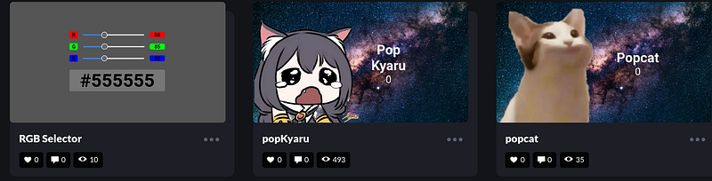
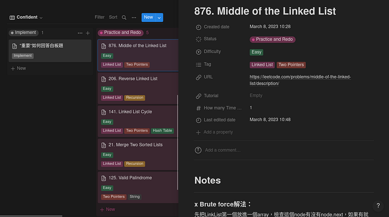
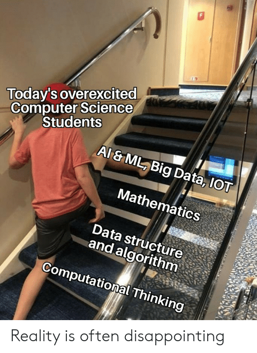

> 封面為於Alpha Camp 2–1學期所做的小遊戲，可以至以下Codepen連結中遊玩喔。

### 前言

本身畢業於會計系，花費長達4年的時間考取會計師執照並在事務所工作一年。但由於過於忙碌並與興趣不合，最後放棄這份工作，並嘗試轉職寫程式。

我在大學與研究所期間上過python的程式語言課程，當時覺得很有趣，再加上事務所上班的苦悶，一個腦衝就辭職報名Alpha Camp，開始轉職之旅。

以下紀錄辭職後的學習情況，也是給未來的自己一個參考。分為3個部份：

1.  Alpha Camp
2.  資料結構
3.  機器學習

此外我的文筆非常差，希望您閱讀的時候不會感覺太痛苦。

### Alpha Camp

我是報名Alpha Camp學期1自修挑戰轉入學期2-1，所以這算是在Alpha Camp中的第1學期。

學期2-1主要分為以下3個部份

1.  JavaScript 核心觀念
2.  CSS與Bootstrap
3.  DOM基本操作

在Javascript的時候學的蠻順利的，因為之前學過一點python，所以學起來比較快。但是到了Bootstap和DOM就整個不行了，學習過程變得非常慢，花費很多時間做筆記和練習。

在2-1中可以學到要怎麼用html+css或是使用Bootstrap來繪製網頁，並且使用基本的JavaScripts控制DOM讓整個網頁動起來，當做完人生中第一個迷你專案後成就感真的很大。

迷你專案就是封面圖片的Pop小遊戲，是Alpha Camp推荐製作的作品。我在點擊後會冒出來小圖片的動畫上糾結了一整天。最後把作品用codepen發佈在網路上，截至撰稿日期已經有493個人來玩過了。

目前也正在寫自己的小小專案，但是不太成功，希望之後可以順利做完給大家看我的成品。

### 資料結構

> 寫LeetCode連Easy都要一小時

學程式肯定少不了資料結構與演算法，目前是在台大旁聽林軒田教授開的[Data Structures and Algorithms](http://www.csie.ntu.edu.tw/~htlin/course/dsa20spring/)，但是他的課程作業對我來說太困難了，要用C語言寫，於是另外在Udemy上面購買[Master the Coding Interview: Data Structures + Algorithms](https://www.udemy.com/course/master-the-coding-interview-data-structures-algorithms/)這堂課程，這堂課的好處是他是用JavaScripts教學，作業同時有JavaScripts、Python、C/C++的答案，可以用比較熟悉的語言練習。

在旁聽台大課程完之後，我會把當週教過的資料結構用Python實作一次（其實才教到LinkList），接著去[neetcode.io](https://neetcode.io/)刷同資料結構的題目當作課程的作業。[neetcode.io](https://neetcode.io/)上面的題目都有Youtube影片解答，可以方便再想不出解答的時候參考。

另外參考[Using Notion to help grind Leetcode](https://medium.com/@nexidian/using-notion-to-help-grind-leetcode-ca5b50bca93f)這篇文章架設Notion上面的刷題學習卡，可以用來紀錄各題目的學習狀態、筆記、解法、Complexity等，想推薦給您。

### 機器學習

> 啊！機器學習，連線性代數都不會也想學機器學習，另外我連CS的學生都不是。

目前在台大旁聽李宏毅教授開設的[機器學習](http://speech.ee.ntu.edu.tw/~hylee/ml/2023-spring.php)，其實這是第三次挑戰這門課了，第一次是上別的老師開的同名課程，第二次因為要考會計師而放棄，這次才真正的想要完整學習一次。

然而學三次狀況還是很差，教學要用的pytorch還是不會用，很氣自己之前為什麼不先學好再來，每天都在浪費時間。我連要怎麼用Jupyter Notebook連回家裡的桌機都要設定一整天，docker完全裝不起來，作業看不懂也不會寫，非常慘澹。

但是這門課的好處在於助教會先把作業寫成一份跑的動的Code，只要再code裏面再調整一下參數，加幾層Neuro Network就可以跑了，並且可以從助教的code學習如何做preprocess、dataset、model、training step，目前我也正在練習這些code，不曉得能不能學會。

### 結語

這份Blog主要是寫給自己的紀錄，也十分感謝看到這裡的您！

希望我可以堅持下去，我們下次再相見!