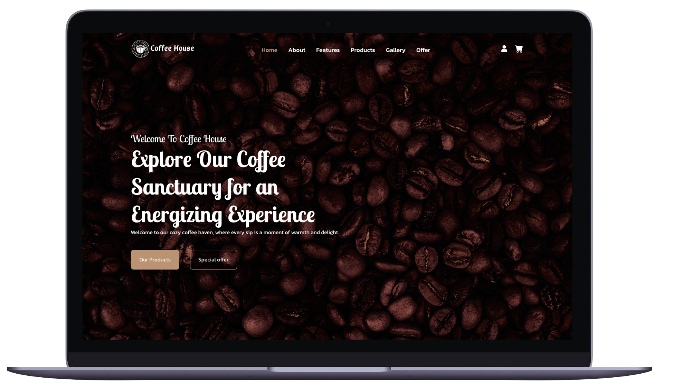
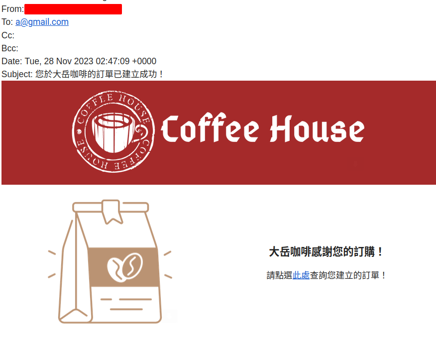

> 上圖為[ailsayang999](https://github.com/ailsayang999)製作的精美網頁

## 簡介

大岳咖啡：一個可以線上購買咖啡與咖啡器具的網站，當打折時會顯示打折後與打折前的金額，並於訂單建立成功後會發送email。

部署網址：[Vercel](https://coffee-shop-eight-indol.vercel.app/#home)

Github：[前端](https://github.com/ailsayang999/coffee-shop)/[後端](https://github.com/TinyMurky/coffee_shop)

前端開發：[ailsayang999](https://github.com/ailsayang999)

後端開發：[seangotjuice](https://github.com/seangotjuice) | [TinyMurky](https://github.com/TinyMurky/coffee_shop)（我）

<iframe src="https://www.youtube.com/embed/E9uWNdJkqy0?si=BuzGUfLYPD1A_2Mh" title="YouTube video player" frameborder="0" allow="accelerometer; autoplay; clipboard-write; encrypted-media; gyroscope; picture-in-picture; web-share" allowfullscreen></iframe>

> 面為[ailsayang999](https://github.com/ailsayang999)錄製的網頁Demo

> 上圖為訂單成功後寄發的email

## 技術選擇

這個專案其實是在[【專案】部落格 X Hacker MD](https://nextjs-blogger-production.up.railway.app/blogs/insight/Nextjs_Blogger)之前開始寫(但是部落格拖到現在才寫@@)，當時還沒有學比較潮的TypeScript和Prisma等等，又擔心直接用沒學好的技術會寫不出來，所以我們選擇以下自己比較熟悉的技術。

### Node.js

選擇Node.js而沒有選擇Bun最主要的原因是因為我很爛我不會，當然我很爛不能當作一個理由。之前在嘗試使用Bun的時候發現它安裝、啟動的速度都很快，而且還直接支援TypeScript。但是Bun需要使用 `Bun.server`(Express也可以)以及與它搭配的[Bun Ecosystem](https://bun.sh/guides/ecosystem)，像是ORM不能用sequelize 而是 Prisma 或 Drizzle。此外Bun目前還很新，網路上的資源比較少，且常常更新，截至撰文當下[Bun Github](https://github.com/oven-sh/bun/issues)上就有1.8k issue與185 pull request。以上的限制讓我們擔心可能會導致專案無法如期完成，因此採用熟悉、穩定且網路資源比較多的Node.js。但我也希望我可以在以後的Side Project使用Bun。

### Sequelize

每次開新專案都會考慮要用哪個ORM，雖然這次選擇Sequelize，但我現在重新回顧發現Prisma可能是更好的選擇。以下是我幾個理由：

- Schema設定：本次專案SQL的table很多，如果用 `schema.prisma` 只要一份檔案就可以設定schema，Sequelize要多達十多份 `model.js`才做的到
- TypeScript：Prisma原生支援TypeScript(寫專案時Sequelize v7還沒release)，這讓型別檢查比較簡單，用Sequelize 6讓我們放棄使用TypeScript。
- 查詢語法不複雜：這個專案用到最複雜的語法是如何用當天日期查詢折扣活動，其中要區分每年固定日期活動與日期不固定的活動(github: [event-sale-activated-helper.js](https://github.com/TinyMurky/coffee_shop/blob/main/helpers/event-sale-activated-helper.js#L6))。沒有一定要用Sequelize才寫的出來的複雜查詢語法。

那為什麼還是使用Sequelize呢？其實還是因為寫的當下對Prisma不熟(雖然現在也是)，因此擔心寫不出來而沒有使用。這也提醒我盡量去多接觸不同的工具，在必要的時候才有比較多的選擇去應付不同的要求。

### Nodemailer

[nodemailer](https://www.npmjs.com/package/nodemailer)搭配gmail可以輕鬆的送出郵件，但需要注意gmail有以下的限制。
- 每日發送限制：500 封
- 單一電子郵件收件者超過 500 封
- 每封電子郵件大小上限：25 MB

### Passport(未實做於前端)

當初專案的設想是登入後才可以購買，於是實做Google與Facebook的 OAuth2。但是後來需要讓客戶在未登入的狀態下也可以把商品加入購物車，並於登入後要與原本就存在Database的購物車商品做整並。最後由於時間不足先捨棄掉登入系統，讓用戶先直接在未登入狀態下建立訂單。但是後端仍保留登入用的 `/api` route。

---

## 我負責的部份

- `/api/products` : 建立可回傳全部商品與單一商品詳細說明的api，api也會回傳商品原價與打折後的價格
- `/api/events` 與 `/api/sales` ：依照當天日期，將當天發生的全站打折活動與個別商品打折活動回傳前端
- `/api/auth/google` ：使用Passport實做Google OAuth2
- 發送email：當訂單建立成功後，使用gmail寄信給下單User。
- Model關聯：建立Sequelize Model與他們的關聯關係
- Seeder：由於咖啡商品是固定的，我先建立json檔後用seeder直接加入Database，建立user、product、全站促銷活動、個別商品促銷活動等資料

---

## 開發心路歷程

這份專案是我第一次參與的前後分離專案，出了不少包，以下是我的經驗分享。

### 沒有理解前端需求

一開始接到需求是要建立 `/api/products` 的時候，我就直接建一個可以把所有products都拉出來的api，還加上可以用query區分是咖啡豆還是咖啡商品，並且實做`limit`與`offset`預備要給pagination使用。但前端其實需要的是先區分咖啡豆與週邊商品兩類，然後向下有各大品項，品項向下才是真正的商品，商品還有分不同的顏色與包裝，並且還要算打折後的價格。由於當初沒有理解要求於是花了很多時間做修改，此外自己擅自修改的pagination其實都不需要，於是都去除了。

### 沒有了解商業邏輯

如同上面段落所述，原本一開始是想要實做只能登入才能加購物車。但後來我們想到一般網頁再沒有登入的狀況下頁也可以加入購物車，在登入後與database內的購物車互補成新的購物車清單。但後來因為變得太複雜加上時間不足而沒有做出來。

此外在創database table時也花了很多時間，因為每個product向下都還有區分不同顏色或包裝，價格也都不一樣。最後討論是將不同顏色與包裝統一放在 `variants` table，與 `products` table 是一對多關聯。並在下訂單的時候，將 `variableId` 與 `productsId` 一起存進 `orderItems` table。`orderItems` 是訂單中的一個項目，與 `order` table為一對多關係。

---

## 結語與未來展望

這份專案目前還只是MVP 模型，我們討論過日後會再實做以下功能，希望可以真的變成日常使用的電商網站。

- 登入與購物車功能
- 串接綠界金流與物流

在開發過程中，發現自己對JavaScript與ORM的掌握度都低於自己的想像。經過這次開發後也讓親身體驗coding需要非常大量的練習，並且每天都要持之以恆。也期許自己可以在這條路上繼續走下去。

---

## 參考

- [Understanding ORMs: Prisma vs Sequelize](https://tinymurky.medium.com/%E5%BE%8C%E7%AB%AF%E5%B0%88%E6%A1%88-%E5%A4%A7%E5%B2%B3%E5%92%96%E5%95%A1-701344c120b2)