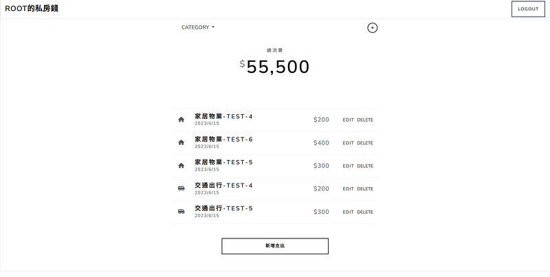
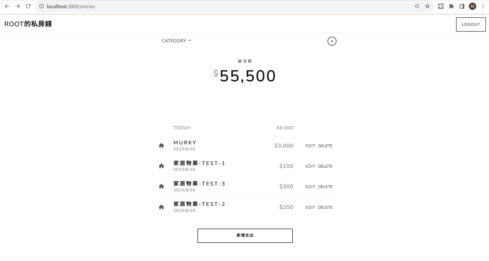
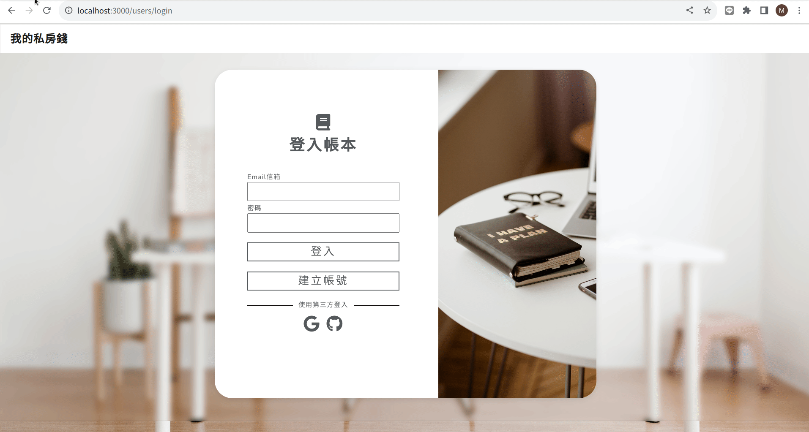
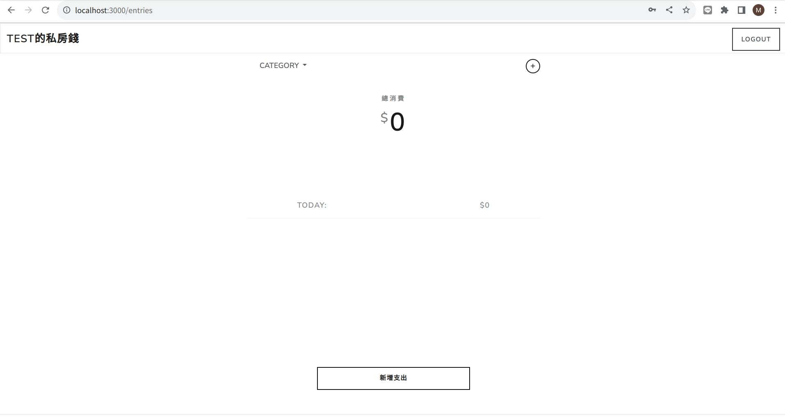
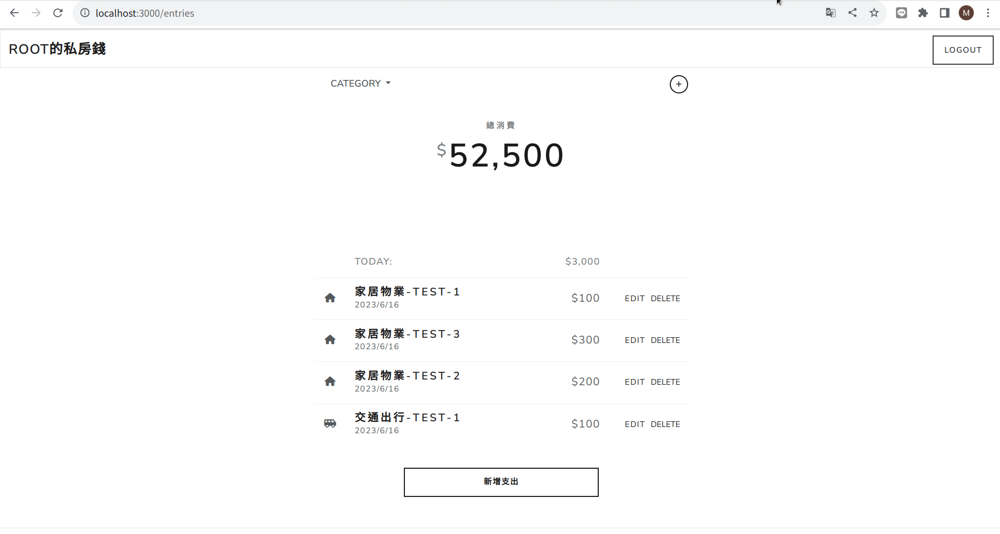
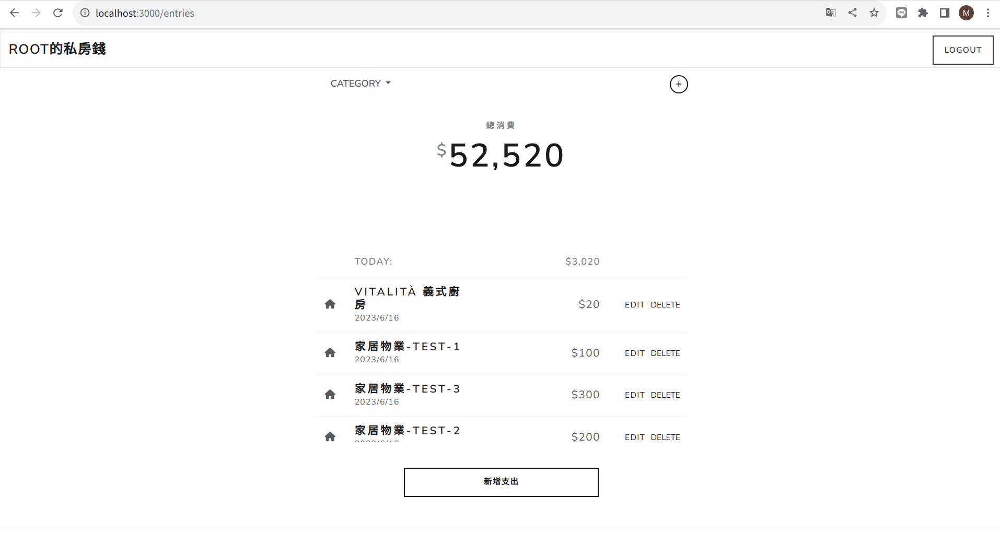

經過一星期的掙扎，我終於完成人生中第一個全端的專案，[記帳程式 - 我的私房錢](https://github.com/TinyMurky/expense-tracker)，終於有機會能夠在這裡像大家介紹這個新專案。

網站連結：[點我](http://ec2-35-78-73-49.ap-northeast-1.compute.amazonaws.com/users/login)

可使用以下帳號密碼試玩：

Email : root@example.com

Password: 12345678

### 為何會選擇寫這個專案？

自己在大學時主修的是會計系，當然要寫一個可以簡單記帳的網站啦，之後還可以給自己使用。

另外這個專案也可以強迫我練習一些網站的基本技術，像是:

*   前端：練習用Bootstraps刻畫面，並把後端拋過來的資料在前端處理後才呈現。
*   後端：練習用ODM連接資料庫、RESTful CRUD API、session-base 登入/註冊系統。

### 這個專案有什麼功能?
>下圖為主畫面

此專案的使用者可以：

-   註冊帳號  
    - 註冊之後，可以登入/登出  
    - 可使用Google與Github帳號註冊/登入  
    - 只有登入狀態的使用者可以看到 app 內容，否則一律被導向登入頁
-   在首頁一次瀏覽所有支出的清單  
    - 使用者只能看到自己建立的資料
-   在首頁看到所有支出清單的總金額
-   可以看到各天花費支出總和
-   根據「類別」篩選支出；總金額與各天支出總和的計算只會包括被篩選出來的金額
-   新增一筆支出
-   編輯支出的內容
-   刪除任何一筆支出

### 這個專案使用了什麼技術？

#### Bootstrap與handlebars

前端畫面主要是用Bootstrap建立，並搭配部份的手刻css做排版與動畫，畫面上的數字加總的部份則是用JavaScript完成。

使用Bootstrap主要的原因是漂亮、排版容易與RWD設計，我的美術天份實在不足，使用Bootstrap可以快速搭出一個整齊美觀的界面，並且還會在不同尺寸螢幕中自動切換，不用自己慢慢刻RWD css。

此外由於專案性質簡單，並不需要使用前端框架渲染，各個動作直接用api操作，並用handlebars從後端直接傳畫面就可以了。

#### nodejs 與 express

使用nodejs主要是因為我很喜歡他的npm專案系統，套件管理與建立環境方便。此外由於前後端都使用JavaScript，對我來說開發起來會更容易更快一些。

使用express的主因是它比較輕量，並且它可以自由運用middleware串接各樣的功能，在處理session-login時很方便。

#### Cookie/Session與Passport

我使用Cookie/Session的方法處理登入登出的問題，主要的原因是程式只在一個伺服器上跑，僅須在一個伺服器上記錄登入狀況，使用者不會來回切換不同的伺服器，因此尚不需要使用JWT。

Passport套件提供多種不同的登入方案，如一般的本地紀錄帳號密碼，也提供OAuth 2.0 的Google、Github登入方案，讓使用者可以用不同方式登入。並且不管是使用email登入，或是第三方登入，只要這些方法會送出同一個email，就可以看到相同的畫面，使用者不用去記上次是用哪個方案登入，比較方便。

#### Bcryptjs

密碼使用Bcryptjs 雜湊處理，比起單純的hash fuction，bcryptjs會連續做特定次數的雜湊，增加密碼安全程度。

#### MongoDB與Mongoose

本專案資料結構簡單，不會使用到資料庫之間的交集、聯集等運算，且以後需要擴充時比較簡單操作，因此選擇使用MongoDB，開發簡單擴充容易，適合本專案。

而nodejs的MongoDB ODM是Mongoose，它提供許多Promise結構的API，讓整體流程比較不會塞車。

### 專案中哪部分相對能掌握與花大量時間的部份

#### 相對能掌握：CRUD API

記帳專案僅需要能新增、修改支出，可以使用form push或put到後端，並且把所有支出費用從後端拋給前端渲染就可以了。

整體操作是前端畫面使用form或連結call API，後端API接到指令後對MongoDB執行相對指令，再把所有支出從MongoDB取出再拋給前端，前端再用JavaScript處理數字加總後呈現。

#### 花大量時間的部份

async/await 與mongoose使用上花費許多時間，主要是處理建立預設資料的部份。此專案可自動建立範例使用者 `root@example.com` 。在建立時會先建立支出類別項目，才會去建立範例支出。但是如果在建立類別後直接建立範例支出，類別中的最後一筆會來不急建立，直接開始建立範例，導致特定類別沒有範例。花了很多時間處理。

### 過程中碰到什麼困難？又如何克服？

我最大的困難就是處理非同步async/await的時間順序問題。如上段所述，在建立類別資訊與範例支出的時間差，造成特定範例支出不會建立的問題。

遇到問題我除了在Google外，我也開始詢問chatGPT。chatGPT可以用更口語的方法闡述問題，對我這種關鍵字苦手很友善。此外找不到bug的時候可以整段程式碼貼上去，請chatGPT幫忙抓bug。例如async function不能使用forEach，Promise.all()裡的promise物件需要return等等。

剛開始學習的時候很排斥ChatGPT，覺得問它會學不到東西，但實際嘗試後它會提供平時自己沒有想到的寫法。例如MongoDB如果物件的id想使用numeric，但又要自動增加。若是使用npm的套件如 [mongoose-sequence](https://github.com/ramiel/mongoose-sequence)，這些套件很多都不在更新。於是ChatGPT建議我再新增一個collection直接紀錄所有其他Collections最新的id，並且在所有物件建立時更新此collection，就可以不用套件實做自動增加數字id。

### 過程中我對哪個技術有特別深刻的學習？

除了上述mongoose的處理之外，我學到最多的是登入套件passport的操作。從最一開始完全看不懂文件與官網，但現在我已經可以了解如何利用使用者的註冊資料建立User檔，登入時利用Passport處理登入成功或失敗，向使用者呈現登入失敗的原因，並於登入在request中附加user物件等。

### 結語

這個專案是我第一個從前端畫面到資料庫全部都是自己架設的專案，讓我體驗到全端開發的感覺。全端開發雖然有一點花時間，但每個步驟都可以自己決定，在調整程式的時候比較順利。最後我還是花超過預期的時間在寫這個專案，而且還有好多想做的功能沒有成功實做，像是依照每一天的花費變成一星期或一個月的長條圖分析的功能。但就像大家說的，專案永遠沒有完成的一天，也期許未來更厲害之後再回來繼續優化這個專案。

### 畫面展示

#### 登入
>使用帳號密碼登入

>使用Github登入

#### 註冊
>使用帳號密碼註冊

#### 登出
>登出後會刪除使用者瀏覽器的Cookie

#### 主頁面
>可以用Category選擇支出類別，總支出與每日支出的數字也會一起更改

#### CRUD
>新增一筆支出

>修改一筆支出

>刪除一筆支出

