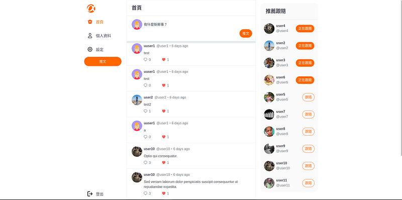


### 簡介

專案: Simple Twitter，一個模擬twitter功能（現在叫做X）的網頁。

AWS部署連結：[simple-twitter](http://simple-twitter-dev.ap-northeast-1.elasticbeanstalk.com/)

Github Repo： [TinyMurky/simple-twitter](https://github.com/TinyMurky/simple-twitter/tree/main)

體驗帳號：

*   前台  
    \- 帳號：user1 (user1~user10都可以登入，密碼都一樣)  
    \- 密碼：12345678
*   後台：  
    \- 帳號：root  
    \- 密碼：12345678

Developer: [Iamcoolalan](https://medium.com/u/ef470ff3858f), [Tiny\_Murky](https://medium.com/u/8dbd3bcec408), 台灣杉

### 前言

終於來到在Alpha Camp學習的最後一個學期，在本學期的最後，我們需要進行多人合作的simple twitter專案，除了檢驗我們網頁開發的能力之外，也是讓學員們體驗多人開發專案的實際情形，並在有限時間(2周)下，完成主管與客戶指定的要求。

專案分成前後端分離與全端開發兩種，本組是三位後端組成的全端開發小組，後端使用Nodejs, Express, Sequelize 搭配資料庫 MySQL，前端則是Bootstraps與純javascript。全端開發要自己切版、寫前端javascript、後端架設routes、連接資料庫，是非常刺激的開發流程。

### 功能簡介(實體展示放至於文章尾端)

以下是本專案主要實做的User Story，更多的畫面展示於本文最底下「[實際畫面展示](#6cfd)」中可以查看。


#### 登入系統

*   使用者可以註冊帳號
*   一般使用者只能登入前台
*   管理員只能登入後台

#### 前台 (一般使用者)

*   使用者可以瀏覽所有的tweets
*   使用者可以新增tweet
*   使用者可以回覆tweet
*   使用者可以對別人的貼文按 Like/Unlike
*   使用者可以追蹤別人
*   使用者可以瀏覽別人的個人資訊
*   使用者可以編輯自己的個人資訊
*   使用者可以查看自己的追蹤清單與被追蹤清單

#### 後台 (管理員)

*   管理員可以瀏覽所有的推文
*   管理員可以刪除貼文
*   管理員可以瀏覽所有的使用者清單

### 使用工具簡介

#### 前端 ：

#### Bootstrap + Vanilla JavaScript + handlebars

由於三位組員都是學習後端，在專案製作當下尚未學習任何套件，因此我們使用handlebars做Server Side Rendering，並搭配Bootstrap切板，簡單的前端邏輯則直接用Javascript完成，如實現infinite scroll（無限捲軸）與前端資料驗證與上傳圖片預覽等。

*   **缺點：**  
    Server Side Rendering的缺點十分明顯，在畫面上做任何動作如按推文like、追蹤用戶、發推等等都會導致整個畫面的更新。並且每次更新畫面都要向資料庫重新取得整個頁面的資料，增加資料庫的負擔。
*   面對以上問題我們做了一點優化：  
    為了避免資料庫每次刷新頁面都要把用戶所有的tweets都傳到前端，每次畫面渲染時，如果該畫面需要渲染多張tweets，我們限制一次只會取出8張tweets，並於使用者滾動畫面時才會使用Axios套件呼叫後端API，並用JavaScript新增於tweets展示區塊中。
*   我們未執行的優化：  
    當用戶按下Like 或跟隨用戶時，應該直接Post到後端api就好，前端再用JavaScript + CSS做畫面更改就可以了，不需要更新整個畫面，可惜當初在開發時我們沒有想到
*   **優點：**  
    使用Server Side Rendering在載入時比使用前端框架時還快一點，並且比較不需要客戶端的效能，並且不需要考慮前後端分離時會遇到的CORS的問題。並且在部署雲端時比較容易一些。  
    我們的專案相較於其他組別在渲染時快上不少，並在執行各種功能時頁面也能快速更新，幾乎沒有等待時間，使用起來十分滑順。

#### 後端

#### Nodejs + express

使用Nodejs的優勢是輕量、可快速執行並容易編寫等特性。Nodejs使用Chrome V8 Engine，直接將JavaScript編譯成機器碼，跳過直譯器的步驟。此外使用Event Loop的Non-Blocking I/O，可同時處理多個Request，並使用非同步處理request，避免阻塞。此外Nodejs可使用NPM快速安裝各種套件，讓開發時間更短更快速，很適合Simple-twitter這樣的小型專案。

Express是Nodejs上的伺服器框架，其優點是輕量且架設route或api相對更容易一些，並且使用middleware的設計讓request的流向更清楚，並生成相對應的response，缺點是需要處理打量的callback。本次專案使用RESTFul 風格的route結構，很適合使用express開發。

#### MySQL + Sequelize

選擇MySQL的原因是因為它對新手比較友善，網路上有許多MySQL相關問題的討論，此外MySQL Workbench可以更容易觀察資料的變化，在開發階段可以直接打開Workbench檢查程式的輸出結果是否正確。

使用Sequelize當作ORM的原因也是相同，Sequelize的文件比較完整，網路上也有許多相關討論。Sequelize在db migrate的時候，表格建立與新增關聯時使用Class來操作，而不是像Prisma需要用SQL原生語言編寫，對新手如我來說比較容易一些。此外本次專案沒有使用GraphQL，暫且不需要使用如Prisma對GraphQL支援度比較高的ORM。

#### Passport with session

專案登入我使用Passport，並採用Session而不是使用JWT。在專案剛開始開發時我原本選擇使用JWT將用戶資訊直接儲存於Client端，原先的想法是如果Client直接發送用戶資訊給Server，就可以節省MySQL的查詢次數並提昇效能。但在實做的時候，我需要在Server每次接收到request時查詢該使用者是否真的存在於MySQL（主因是我的passport JWT Strategy的code寫得很混亂，正常情況下應該可以信任JWT儲存的資訊），變相增加訪問MySQL的次數，最後才改用Session的方法，把用戶資料存在記憶體的方式減少MySQL的負擔。

#### imgur + multer

圖片上傳選擇Imgur套件，直接將使用者的圖片上傳至Imgur.com，並使用multer套件讓使用者在送出帳戶資訊修改時，可以同時修改文字資訊並上傳新的圖片。未直接將圖片除存於本地是因為當部署至AWS時需要使用S3儲存本地資料，而開發當下我尚未研究如何將圖片存在S3當中。

#### 部署：

#### AWS Elastic Beanstalk + RDS

本專案部署於AWS，使用 Elastic Beanstalk部署專案，使用Elastiv Beanstalk而不直接使用EC2是因為本專案規模較小、開發時間短且使用的程式語言(nodejs)與套件都是常見選擇，並不需要花費太多時間在客製化EC2，直接使用 Elastic Beanstalk設定好的伺服器進行部屬。

MySQL則是另外部署在RDS上而不是直接安裝於EC2，理由同樣也是因為本專案規模小，開發時間短，不太需要去自己設定一台EC2存放資料，使用AWS預設好的RDS可以快速串接後端與資料庫，但是要小心免費使用期限，避免付不出帳單。

### 我於專案中的角色
>我於前端實做infinite scroll的效果

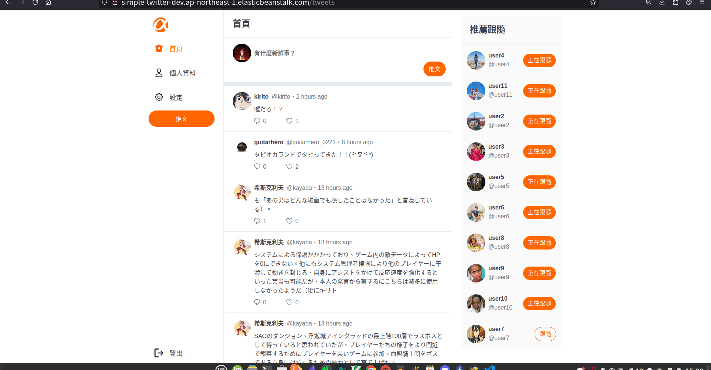

#### 前端：

1.  `/tweets` 、 `/replies` 、 `/users/:id/following` 、 `/users/:id/followers` 四個主要頁面，分別是首頁、回覆、追蹤者與正在追蹤四個頁面，並負責編寫以上頁面的javascript，如modal的渲染與前端字數檢查等。
2.  左側navbar的切板。
3.  於所有需要呈現tweets的頁面、後台的 `/admin/tweets` (呈現所有用戶的tweets)、 `/admin/users` (呈現所有使用者的User Cards)實做infinite scroll的效果，進入頁麵食只會渲染8張tweets或是User Card，並於用戶拉動視窗時載入更多資料，節省資料庫的效能。

#### 後端：

1.  登入/登出與驗證的功能，確保使用者需要登入才能訪問，並且一般用戶不能登入後台。
2.  架設Sequelize 的Modal。
3.  `/tweets` 、 `/replies`、 `/users/:id/following` 、 `/users/:id/followers`四個頁面的CRUD routes。

#### 部署：

我負責將專案部署於AWS，執行以下動作：

1.  於RDS上架設MySQL，並建立表單與示範用假資料（seeder）。
2.  上傳專案至Elastic Beanstalk。
3.  將RDS串接至Elastic Beanstalk。

#### 其他：

1.  管理Github：  
    Github設定為 Pull Request需要1份Peer Review才能夠Merge。
2.  設立Notion：  
    我負責架設Notion的Database架構，讓成員更容易紀錄與溝通。採用巢狀結構，先依照User Story建立文件，各個User Story向下有Acceptance Criteria，向下又分成各項task，當各個task檢驗合格之後，才算是通過Acceptance Criteria，當所有Acceptance Criteria通過之後，才算一個User Story通過。

>[Notion資料庫點我](https://www.notion.so/6dbd4e4d798d449b9726cea78485ac56)

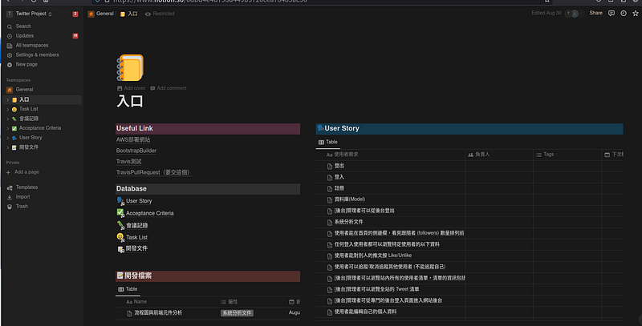

3.流程圖與元件分析

在開始進行前端切板前，我負責將設計圖上各個頁面與元件之間的動線簡化成如下的流程圖，並將各頁面重複的元件先做分類，讓切板可以先從各部份的元件開始切。

>[使用miro規劃前端流程圖](https://miro.com/app/board/uXjVMsO-T8k=/?share_link_id=148308668658)

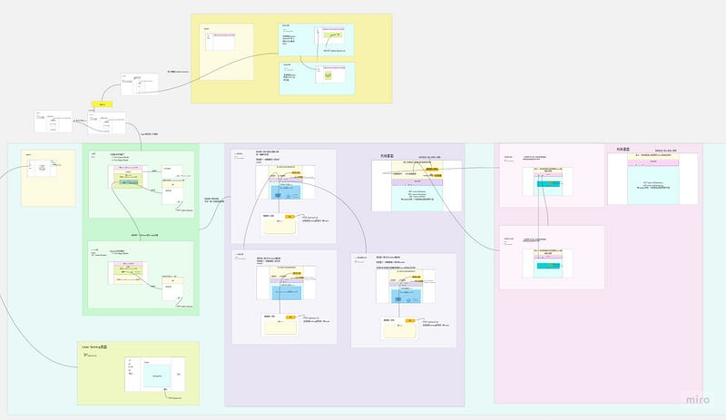


### 開發的心路歷程

這次專案僅有兩個星期，並且有一位夥伴平時比較忙碌，大部份的時候都只有兩個人在開發，工作量比想像中的還要大。

專案開始時真的很迷茫，完全不知道該怎麼開始，於是 [Iamcoolalan](https://medium.com/u/ef470ff3858f) 先負責將User Story拆成Acceptance Criteria，台灣衫負責設計RESTful routes，我則負責前端的流程圖與元件分析。

接著我快速寫出一個用JWT登入的簡單畫面，架設express後端伺服器，完成sequelize的modal，並部署在AWS上，部署時在安裝Elastic Beanstalk CLI的時候遇到一些小問題，好在後來成功解決。

成功部署後我們先使用Bootstrap 依照Figma的設計圖先刻出各個畫面需要使用的Components，並把各路由先使用Components組成靜態頁面。

在前端與資料庫ORM都先架好初步版本後，我們才開始寫後端的功能，並寫一個功能就會跑一次測試，確保程式符合使用者的需求(還有避免bug)。後端功能比較簡單一些，我們組遇到最大的挑戰主要還是在前端與vanilla JavaScript的編寫。

#### 優化

這邊要先謝謝我們組的Mentor Oscar!!! Oscar很用心的看我們的code還提出很多的優化方向與建議。

#### 1\. Clean Code 無瑕的程式碼

Oscar提醒我們最好的程式碼其本身就是註解，程式碼要寫的可以直接閱讀，而不是每一行都要加一段註解。 在變數的命名上要有意義，並且一個function就做一件事情，如果程式邏輯太雜亂，比起加一堆註解，直接重新編寫會更好。

#### 2\. 程式架構

這次專案是使用MVC架構，但由於對該架構不熟悉，我都把function隨便放置，像是如果會重複使用的code我會開一個helpers資料夾把所有function都丟進去，寫到後來自己都找不到code放在哪裡。

Oscar提醒說MVC架構下，Controller可以再向下拆出Service放商業邏輯，用Controller負責呼叫Model控制Database，將資料交給Service Function處理成我們要的型態後再交給View渲染。

#### 3\. ORM優化

在使用Sequelize時，[文件](https://sequelize.org/docs/v6/advanced-association-concepts/eager-loading/#required-eager-loading)中提到如果在find的時候設定require為true，就可以強迫使用inner join，才不會一次撈出一大堆資料。

```javascript
User.findAll({  
  include: {  
    model: Task,  
    required: true  
  }  
});
```

此外Sequelize有提供直接寫SQL Script的查詢方法 [](https://sequelize.org/docs/v6/other-topics/sub-queries/) `[sequelize.literal](https://sequelize.org/docs/v6/other-topics/sub-queries/)`，如下是在搜尋所有tweets時使用的 `sequelize.literal` ，用來取一些特殊的小變數（ex:此推文是否已經被按過愛心)的時候很方便。

```javascript
 followingUsersTweets: async (userId, { limit = 9, page = 0 } = {}) => {  
    const offset = pagiHelper.getOffset(limit, page)  
    const tweets = await Tweet.findAll({  
      include: \[User\],  
      attributes: {  
        include: \[  
          // 使用 sequelize.literal 創建一個 SQL 子查詢來計算帖子數量  
          \[sequelize.literal('(SELECT COUNT(\*) FROM Likes WHERE Likes.tweet\_id = Tweet.id)'), 'likes'\],  
          \[sequelize.literal('(SELECT COUNT(\*) FROM Replies WHERE Replies.tweet\_id = Tweet.id)'), 'replies'\],  
          \[sequelize.literal(\`(SELECT COUNT(\*) FROM Likes WHERE Likes.tweet\_id = Tweet.id AND Likes.user\_id = ${userId})\`), 'isLiked'\]  
        \]  
      },  
      order: \[\['createdAt', 'DESC'\]\],  
      raw: true,  
      nest: true,  
      offset,  
      limit  
    })
```

Oscar提醒我們一定要小心 SQL injection攻擊，所有字元需要使用Sequelize預設的 `[sequelize.escape](https://stackoverflow.com/questions/58606137/sequelize-escape-string-in-a-literal-string)` [](https://stackoverflow.com/questions/58606137/sequelize-escape-string-in-a-literal-string) 來避免被攻擊，然而本專案尚未實做這部份。

```javascript
const escapedSearch = sequelize.escape(\`%${myVar}%\`);  
sequelize.literal(\`"foo".name ILIKE ${escapedSearch}\`);
```

#### 4\. Infinite Scroll無限捲軸

Oscar向我們建議為了減輕Database的負擔，應該實作Pagination 或是Infinite Scroll ，頁面載入時僅從Database查詢前幾筆資料，並在使用者於Scroll bar拉到底部時再由前端發送GET request 至後端要求更多資料並接在原本資料的後面。

後端僅需要建立新的API，從前端request當中的query取出offset與page的參數，將這兩個值傳遞給Sequelize的查詢function就可以了。

```javascript
 getTweetsUnload: async (req, res, next) => {  
    try {  
      const { limit, page } = req  
      const userId = helpers.getUser(req).id  
      const tweetsUnload = await tweetServices.followingUsersTweets(userId, { limit, page })  
      // followingUsersTweets 就是ORM優化段落中的followingUsersTweets function  
      // 剩下跳過  
  },
```

前端難處在於判斷什麼時候要項後端發出request（這邊可以參考網站：[元素大小和滾動](https://zh.javascript.info/size-and-scroll)），參考以下圖片可以得知 `scrollHeight`是整個頁面的高度， `clientHeight`是顯示器中展現的高度， `scrollTop`是被隱藏在顯示器上方剛剛被滑過去的高度。在未實做infinite scroll的情況下，當頁面被拉到最底的時候 `scrollHeight`會等於`clientHeight` + `scrollTop`

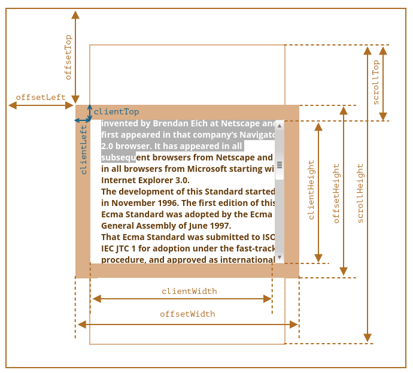

我使用以下程式碼實做： `scrollHeight - scrollTop <= clientHeight + 100` ，我將scrollTop移到等式左邊， `clientHight` 加上 `100px` 是因為我希望可以在拉到最底端上方 `100px` 時就先發出request，預先載入之後的資料。並且在每次觸發request時我都將 `Page` +1，在下次request的時候就會正確的向Sequelize要求更往後的資料。

```javascript
const container = document.querySelector('.scrollbar-hidden')  
const TWEETS\_LIMIT = 8  
let mainTweetsPage = 0  
  
container.addEventListener('scroll', unlimitDraw)  
async function unlimitDraw () {  
  // 程式邏輯為以下這一段  
  if (container.scrollHeight - container.scrollTop <= container.clientHeight + 100) {  
    mainTweetsPage += 1
```

### 結語

謝謝超強的 [Iamcoolalan](https://medium.com/u/ef470ff3858f) 與 Mentor Oscar! 沒有你們就沒有這次的專案！

Simple Twitter專案也給了我一劑強心針，讓我學習到如何從無到有的建立一個專案，為接下來自己的side project做準備。

### 實際畫面展示

更詳細的展示畫面可以至[TinyMurky /simple-twitter](https://github.com/TinyMurky/simple-twitter) 觀賞

#### 前台

登入
>使用非admin帳號登入前台

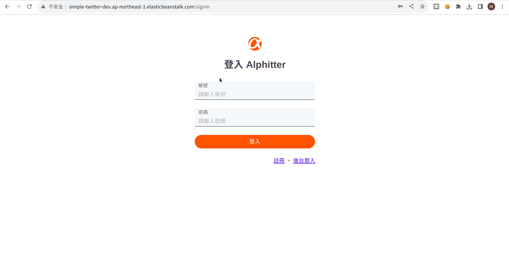

註冊
>使用註冊頁面註冊，需提供用戶名稱、帳號、密碼、密碼確認與信箱，註冊後頭項與背景為預設值


首頁
>首頁可以查看自己與已追蹤使用者的所有貼文，依照時間順序最新的排最上面。

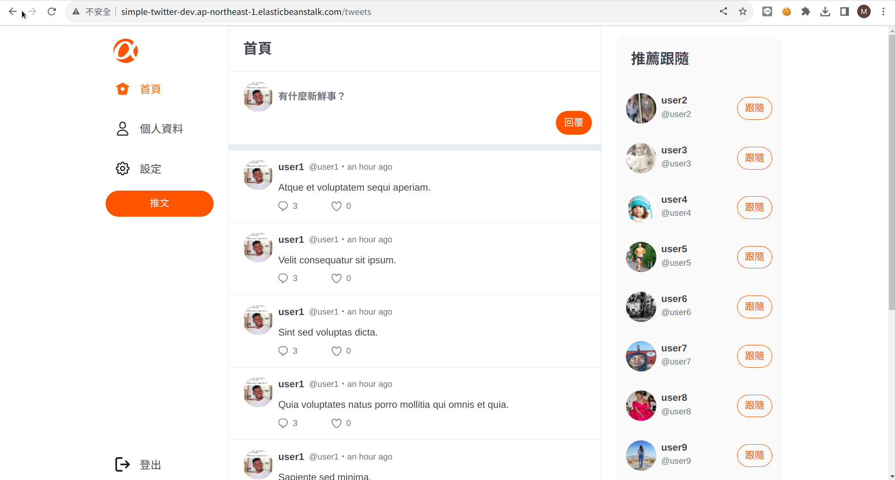

發送推文
>點擊上方的「有什麼新鮮事？」區塊，就可以跳出推文Modal, 輸入與送交推文時，會檢查字數是否於1~140字之間，若不是則禁止上傳並出現提示字樣。 送交成功後會出現通知訊息。

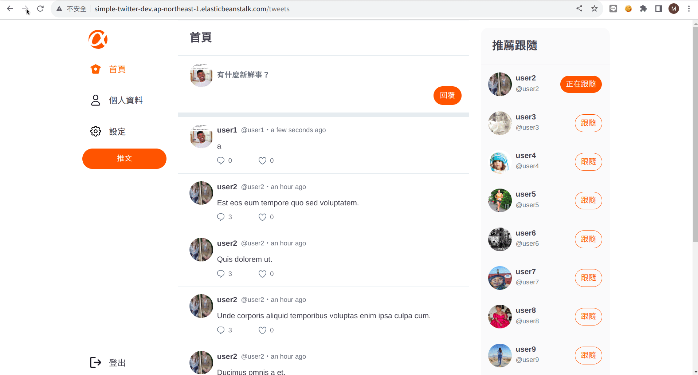

回覆貼文
>點擊`/tweet`或`/reply`頁面上的對話框icon，就可以跳出回覆Modal, 輸入與送交回覆時，會檢查字數是否於1~140字之間，若不是則禁止上傳並出現提示字樣。 送交成功後會出現通知訊息。


對貼文Like/Unlike
>點擊`/tweet`或`/reply`頁面上的愛心icon，可以對喜歡的推文like，愛心會變成紅色，再按一次可以unlike

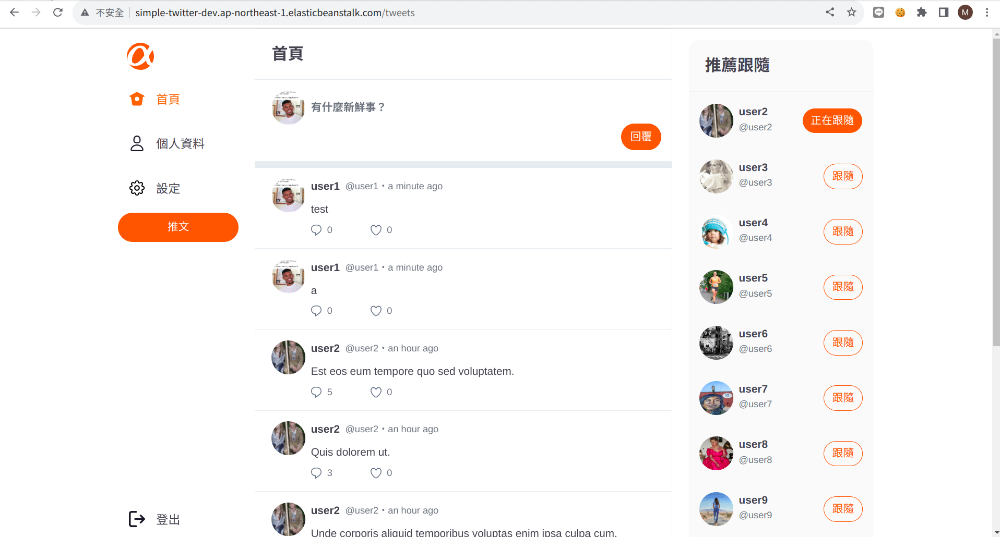

追蹤使用者
>點擊跟隨圖案可以跟隨用戶，並使該用戶的推文在/tweets上出現被追蹤者的tweets


個人界面
>點擊左方「個人資料」可以進入登入用戶的個人界面

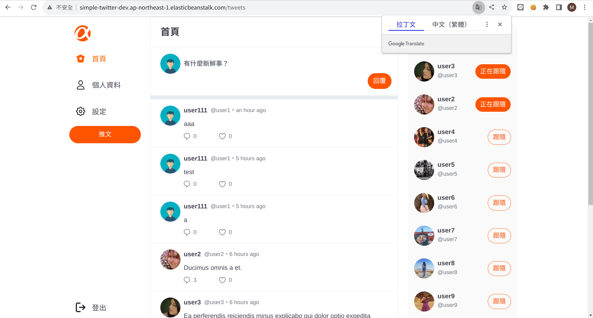

>點擊任一頭像或名稱可以進入該用戶的個人界面

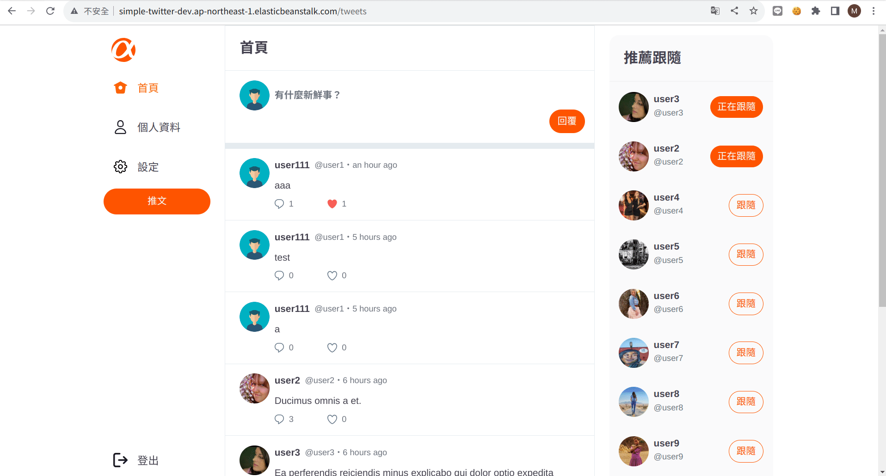

>在「推文」中可以看到該用戶的所有推文，也可以在此處like或回覆此貼文


>在「回覆」中可以看到該使用者所有的回覆，點擊後可以到`/reply`頁面查看原始推文


>在「喜歡的內容」頁面可以看到該使用者所有喜歡的推文，如果在登入使用者的頁面取消喜歡，該推文會消失

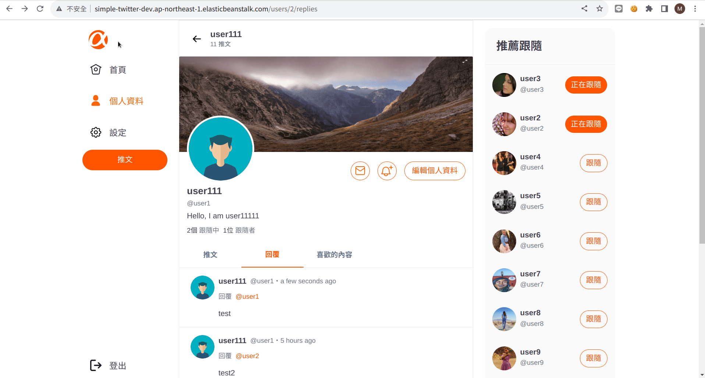

編輯個人資訊
>個人頁面中點擊編輯個人資料可以修改頭像、背景、名稱與自我介紹，並有規定字數，若超過該字數則無法修改。

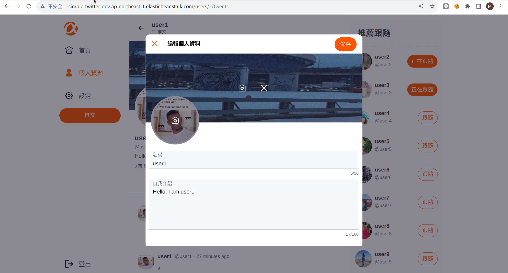

#### 後台

首頁
>「推文清單」中，依照tweets的建立時間順序由近至遠呈現所有tweets

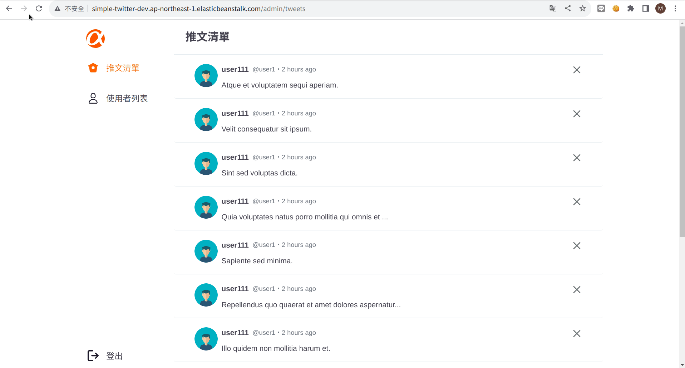

刪除貼文
>「推文清單」中，依照tweets的建立時間順序由近至遠呈現所有tweets

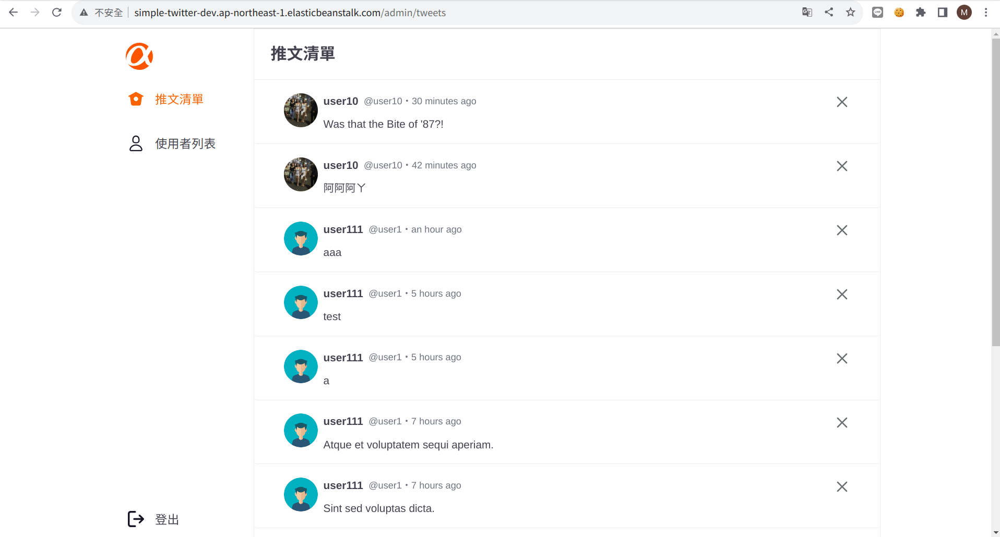

查看所有使用者
>在「使用者列表」中，`admin`以外的使用者依照他們所發送的tweets數量由多至少排序，已卡片形式排列。

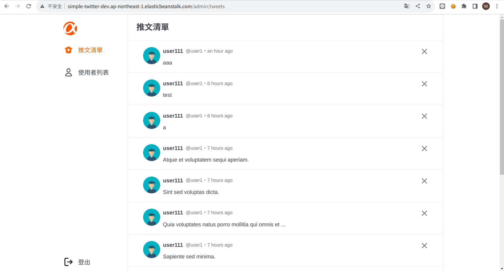