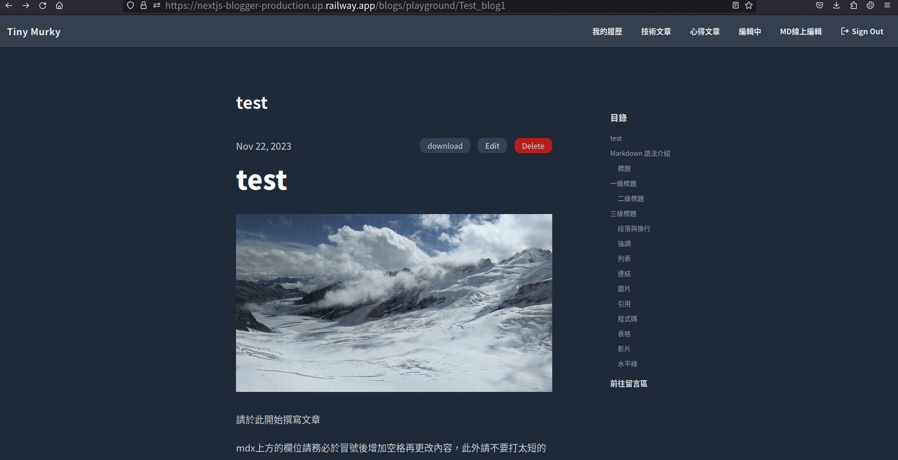
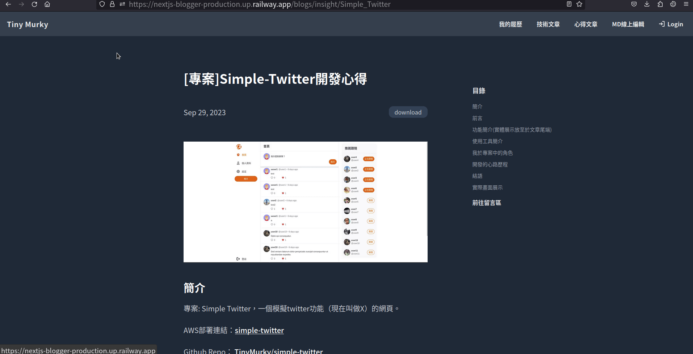
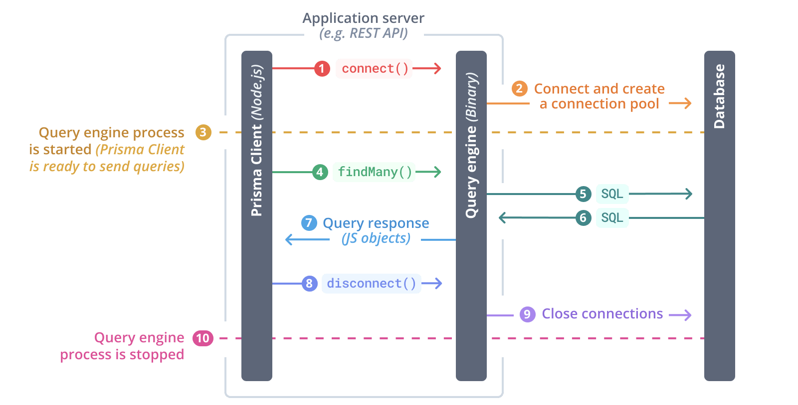
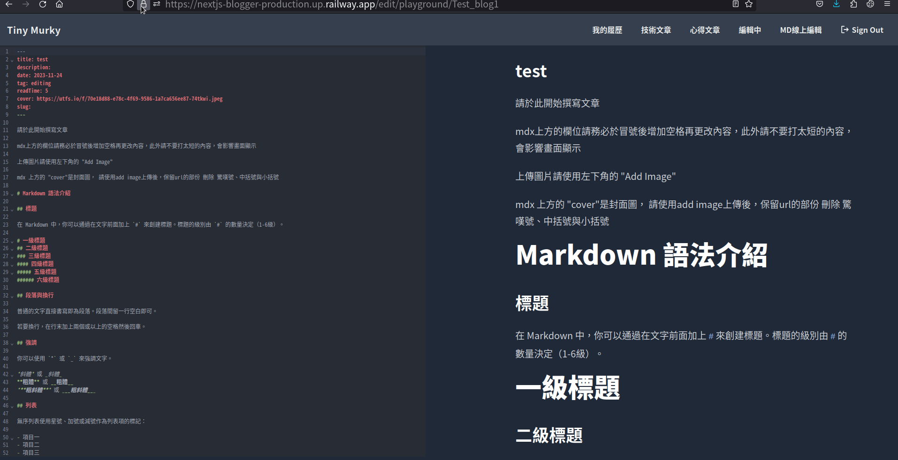
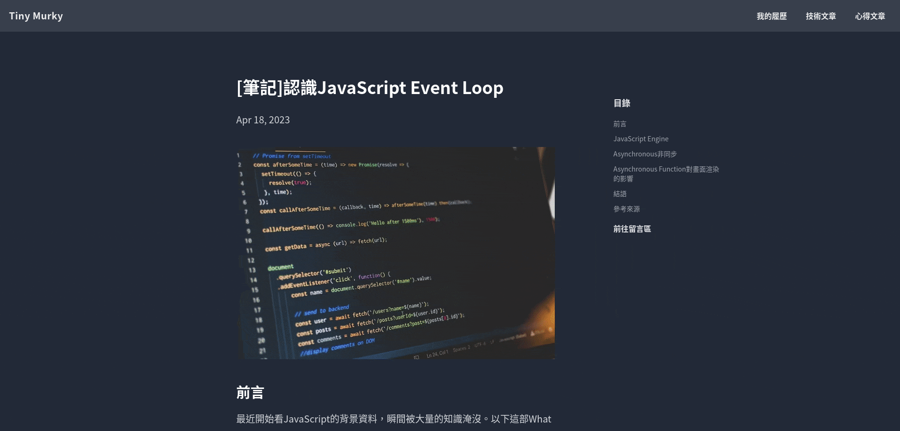
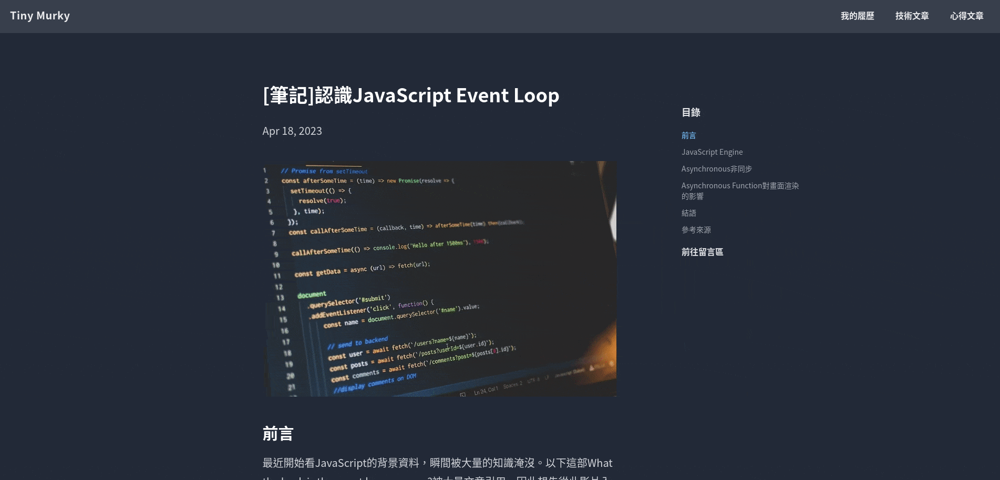
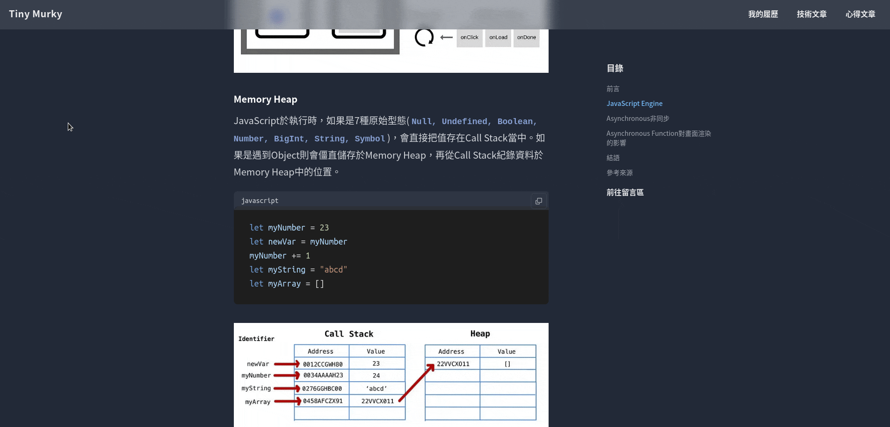
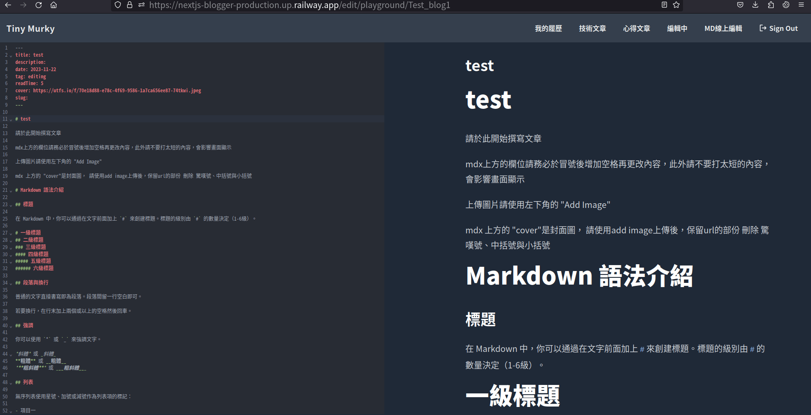
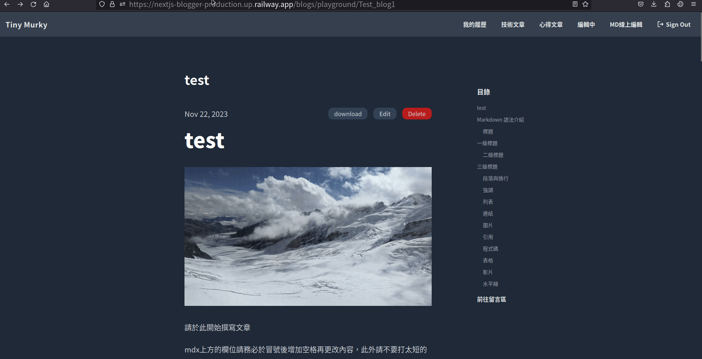
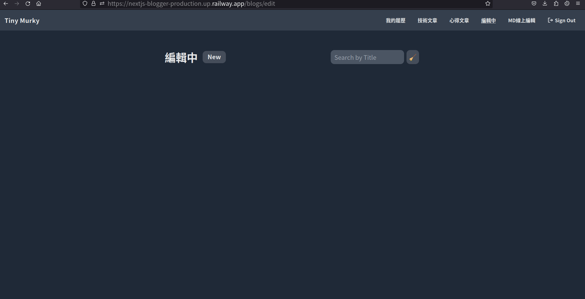

## 簡介

我的個人部落格，可用Markdown語法新增與修改部落格內容。如果想試試看如Hacker MD般的編輯體驗，可以點入此專案的MD 線上編輯頁面。

編輯時點選Add Image可上傳圖片，編輯完按Finish存檔後，於文章頁面點選download，會將部落格以md檔案形式下載到您的電腦，所有上傳的圖片也會一起下載到同一壓縮檔的 /images 資料夾，md檔中的圖片連結也會轉成相對路徑指向 ./images/ ，可以直接使用vs code、obsidian等軟體直接開啟md檔。

目前登入功能暫不開放不好意思@@但是所有功能都可在MD 線上編輯頁面使用。

專案部署網址：Railway (您現在正在看的這個網頁)

Github Repo：[nextjs-blogger](https://github.com/TinyMurky/nextjs-blogger)

開發人員：TinyMurky

>按右下角的Finish 存檔
>


>回到編輯好的文章，點擊download下載



---
前言

不曉得大家在用Medium的時候是不是覺得編輯起來總是感覺沒那麼方便，我平時習慣用Markdown語法編輯，就覺得Medium編輯起來有點不自由。像是 `Code Block` 這種就很不好打。但是Markdown編輯軟體如Hacker MD 或是Obsidian這種，沒辦法向Medium一樣漂亮的展示所有的文章給別人閱覽。於是我想要結合兩個網站的優點，打造一個屬於我自己的部落格。

這篇文章有一點長，可以直接到最底部的功能展示觀看GIF功能展示，或直接進入部落格體驗。

---

## 功能簡介(實體展示放至於文章尾端)

- 部落格本文
    - 將markdown 部落格文章轉為html呈現
    - 部落格右側有動態目錄，高亮顯示目前章節，且可點擊滑動至目標章節
    - 各章節標題實做anchor tag，分享網址更方便
    - 部落格code block 實做複製功能
    - 部落格下方加入第三方套件giscus，實做留言板功能
    - 部落格圖片實做placeholder。載入時會先載入模糊圖片，之後才載入一般圖片

- 瀏覽頁面功能
    - 部落格依照心得文章、技術文章、編輯中、MD線上編輯區分不同Router
    - 部落格瀏覽頁可依照標題和文章的tag(我幫文章加的屬性標籤)搜尋文章
    - 所有頁面皆為static 或是  server side generation(SSG)讀取更快速(`/api`不是)

- 登入功能
    - NextAuth實做Github登入，登入後開啟`/blogs/playground`（MD線上編輯）以外route的編輯功能，開放使用`/blogs/edit`(編輯中）route 的 `new`、`edit`與`publish`功能
 
> 按右上角可以用Github登入(我已經登入過所以不會呈現登入畫面)




- CRUD功能
    - 於`/blogs/edit`(編輯中，須登入)、`/blogs/playground`（MD線上編輯）route中有`new`按鈕可以新增一篇新的部落格
    - 於登入後每篇文章皆可編輯，點選部落格本文的`edit`按鈕進入`/edit/[categoryId]/[blogId]`route。直接使用`markdown`格式編輯文章。
    - 編輯頁面右下角的control pannel有以下三個按鍵
        - `Save`：儲存部落格的更改
        - `Finish`：儲存部落格更改，並離開頁面回到`/blogs/[categoryId]/[blogId]`
        - `Add Image`：將圖片上傳到雲端平台[uploadthing](https://uploadthing.com/)，並將url直接插入`markdown`檔
    - 在`/blogs/edit/[blogId]`頁面有`publish`按鈕，可將編輯中的部落格移轉至`/blogs/tech`(技術文章)或是`/blogs/insight`(心得文章)，此動作無法逆向。
    - 每篇部落格都設有`delete`按鈕可刪除，已上傳的圖檔**不會**刪除
    - 以上功能除了`publish`以外都可以在`/blogs/playground`（MD線上編輯）以未登入身份體驗
    - 所有文章皆有`download`按鈕，可下在該文章的`markdown`檔，文中所有在`uploadthings`上傳的圖片會配放在同一個壓縮檔的`./images`資料夾。下載的`markdown`檔案中所有`uploadthings`連結會被更改為相對路徑指向`./image`資料夾

- 其他功能
    - 實做RWD，手機也可輕鬆閱覽
---

## 使用工具簡介

這個專案其實也是我對自己的小挑戰，我是在Alpha Camp學習寫程式，主要是用 `Node.js / express` 做後端開發。這次我想挑戰在沒有任何Boots Camp的幫助下，使用從來沒接觸過的技術，並強迫自己閱讀官方Document與其他線上資源做開發，加強自我學習的能力。

### Framework

本專案是全端開發，因此採用Next.js 14 作為開發框架。一開始選擇Next.js最主要的原因是因為React對我來說太複雜。我是以後端為主，這是我第一次接觸前端的框架。因此選擇感覺更平易近人的Next.js。

撇除我技術太爛的原因，Next.js有許多功能契合本次開發的要求，例如：

- **[SSG](https://nextjs.org/docs/app/building-your-application/routing/internationalization#static-generation)**: Next.js提供Static Side Generation(SSG)，所有SSG生成的頁面都是在專案Build的時候就打包成完整的HTML，特別適合內文不常會變動的部落格文章使用，且使用SSG讓搜尋引擎更容易抓我們網站的內容，SEO會比較好。
- **[Cache](https://nextjs.org/docs/app/building-your-application/caching)**: Next.js內建cache，用戶在第一次fetch網頁後Next.js會自動在server端生成cache，下次再訪問時會先看到cache的內容，減輕資料庫負擔。如果伺服器更新資料，只需要呼叫內建的revalidate function讓client端的cache失效，下次再訪問時會生成新的cache。
- **[Api Route](https://nextjs.org/docs/app/building-your-application/routing/route-handlers)**: Next.js可以直接在專案 `/app/api`路徑下撰寫後端Api，不需要向前後端分離專案一樣開兩個port，可以省去不少CORS同源政策的麻煩設定。
- **[Server Actions](https://nextjs.org/docs/app/api-reference/functions/server-actions)**: Next.js 14 新增的功能，可以在前端 `use client` 的component直接呼叫後端 `use server` 的function，讓前端不需要用fetch就能呼叫後端function，開發上更方便簡潔。
- **[圖片優化](https://nextjs.org/docs/app/building-your-application/optimizing/images)**: Next.js提供``的優化版本 `<Image \>`tag，它支援WebP and AVIF檔，且可實做 blur Image，在部落格第一次載入的時候，圖片會先載入檔案比較小的模糊版圖片，加快loading速度且防止文章跑版。很適合有大量圖片需要載入的部落格(我很喜歡放圖片)

### TypeScript

Next.js原生支援TypeScript，連手動compile都不用，還有不用的理由嗎？其實這也是我第一次使用TypeScript，因此也只能提供比較主觀的想法。

這次開發我都還是用Function Programming為主，沒有體驗到TypeScript強大的OOP語法。TypeScript對我這種菜鳥工程師來說最大的好處是**強型別**。在寫funciton的時候需要設定輸入與輸出的type，object則是要設定interface，雖然很花時間，但是使用vs code開發時，只要import定義好型別的物件，vs code會自動提示這個function應該要放什麼值，或是object會主動告訴你裡面有什麼property可以用。對我這種金魚腦真的幫助很大。以往開發JavaScript的時候，常常隔一天就忘記function的功能，要一直回去翻code。使用TypeScript讓我開發順利很多。

### Tailwind

Next.js原生支援Tailwind，後端工程師的一大福音，我不會寫SCSS，Tailwind可以用class的方法快速刻出前端(而且Tailwind的預設顏色都很漂亮)。Tailwind 還有 [tailwindcss/typography](https://tailwindcss.com/docs/typography-plugin) Plugin，可以使用預設的部落格排版，讓畫面更好看。
Prisma

ORM我選擇使用Prisma而不是我習慣用的Sequelize。除了想挑戰沒接觸過的ORM的原因之外，Prisma提供比較簡潔的Schema。如果是用Sequelize Cli，有兩張table就會有2個model檔與2個migration檔，Prisma只要一份 `schema.prisma` 檔就好，開發更容易。另外Prisma原生支援TypeScript，和Next.js搭配比較容易。

但使用Prisma需要注意到它是利用Rust寫的Engine驅動，也就是說它不僅讓開發者距離SQL有[多兩層的Abstraction](https://www.prisma.io/docs/concepts/components/prisma-engines/query-engine#the-query-engine-at-runtime)，在[Deploy之後Prisma Query Engine會佔據一部分的memory(10~20MB)](https://codedamn.com/news/product/dont-use-prisma)，這在使用Amazon Lambdas等無伺服器運算服務時很容易不小心超過50MB上限，要非常小心。

>Prisma App server



### Mdx-bundler

[mdx-bundler](https://github.com/kentcdodds/mdx-bundler)可以將mdx檔(md檔但是可以插入React components)轉換成一段bundled code之後再轉成React Component，讓mdx檔可以直接轉換成HTML，其中可以加上rehype和remark的相關套件讓mdx支援更多語法，如 code block的syntex highlight。mdx-bundler也可以客製化不同的html tag。像是code block都被包裝在 `<pre>`tag，就可以改用自己客制的`<pre>`tag，像是幫code block加上複製按鈕。

### Code Mirror

[code mirror](https://codemirror.net/)可以用來實現網頁端代碼編輯器，支援syntex highlight、自動縮排、智能提示等功能。我其實到寫完這個專案都不太會用code mirror，都是到處拼貼別人的程式碼，但我主要需要的功能只需要一個可以寫code的地方，一此只使用code mirror最基本的功能，就是呈現一個EditView讓使用者可以coding markdown語法。

>下圖左邊區塊就是使用code mirror



### Uploadthing

[Uploadthing](https://uploadthing.com/)是支援Next.js與React的免費雲端圖片庫，它提供`UploadButton` 和 `UploadDropdown` component可以直接放入 `jsx` 當中，如下圖右下角的 `Add Image` 按鈕，可直接上傳圖片到Uploadthing之後回傳url。

>右下角紅色Add Image就是Uploadthing提供的Component


### NextAuth

登入我選擇使用[NextAuth](https://next-auth.js.org/)，它提供多種登入方式，我目前是選擇Github登入。它預設使用JWT方式登入(也可更改為session)，並可使用middleware決定哪些route需要登入才能進入。也可使用它提供的 `useSession` hook讓前端規劃哪些component只有在登入的情況下可以使用。

### Giscus

[giscus](https://giscus.app/zh-TW)是一個簡單好用的GitHub Discussions 驅動的留言系統，只要與github帳號連接並在 `jsx` 中引入component就可以接生成留言區。

### 部署：Railway

這次部署沒有使用Vercel或AWS。Vercel屬於無Server式的部署網站，我沒辦法用Vercer跑Prisma的seeder。

我有使用過AWS部署我的[Simple Twitter](https://nextjs-blogger-production.up.railway.app/blogs/insight/Simple_Twitter)專案，但是太貴又很複雜，這個部落格以後我會常常使用，還是選擇可以直接從Github一鍵部署，價格比較便宜的Railway。此外Railway CLI很直觀，就像是在local端直接操作指令，因此最後選擇Railway部署。

---

## 開發心路歷程與技術上的困難

以下這段比較冗長而且比較主觀，可以直接往文章最後觀看GIF畫面展示。

這個專案我開發將近一個月，其實沒有想過會寫這麼久，原本預計兩個星期就應該要完成，但是中途重構整個專案兩次，才花了這麼多時間。

專案作品的最起源我從Alpha Camp畢業，想要做一個記帳APP，但是我前端只會用Bootstraps搭配Handlebars，於是開始學習Next.js與React。我在觀看Dave Gray的[Next.js Tutorial for Beginners | Next.js 13](https://www.youtube.com/watch?v=6h649f2fB9Q&list=PL0Zuz27SZ-6Pk-QJIdGd1tGZEzy9RTgtj&ab_channel=DaveGray)教學影片時，有一個小作業是個人部落格，於是我決定擴充這個作業，把它做的更完整一點，當作記帳APP的前置練習。

一開始我只想做全前端專案。是用 [`remark`](https://www.npmjs.com/package/remark)套件將本地端的md檔案渲染成html。架好整個部落格之後，想要幫部落格本文加一些小裝飾如右側目錄、code block複製按鈕等，才發現只用`remark` 不太容易實做。

之後看到[Eason Chang](https://easonchang.com/)大神的[部落格教學](https://easonchang.com/posts/modern-nextjs-blog-summary)，發現他是使用Next.js 推薦的官方套件 [Contentlayer](https://contentlayer.dev/)。Contentlayer是[mdx-bundler](https://github.com/kentcdodds/mdx-bundler)的加強版，它可以把本地端mdx檔直接轉成mdx-bundler的bundle code然後再轉成React component。也就是不需要架資料庫就可以直接使用mdx-bundler。並且可以直接客制html tag抽換mdx-bundler預設的tag，像是 `<h1>` 標題可以幫它加一個ancher tag，code block的 `<pre>` 可以加一個複製按鈕。

開發完成之後，想要繼續擴充後端，把文章從本地端改放在資料庫裡面，然後增加可以線上編輯Md檔的功能，卻沒想到是苦難的開始，以下是我遇到的一些技術上的困難：

### Contentlayer與Mdx-Bundler

contentlayer套件本身需要使用local端的md檔，也就是說如果我若要將資料庫的文章轉成部落格，我需要先把資料庫的文章取出，放在local的資料夾裡，再轉成html，這讓資料庫變得完全沒有意義。

後來我查到contentlayer是使用mdx-bundler套件實做，mdx-bundler本身只有將mdx轉成React component的功能，不需要考慮檔案的來源，於是我改用mdx-bundler直接從資料夾取出md檔，compile成bundle code再存回資料庫(這是因為我的Md編輯器會需要bundle code作為static的初始值，不然會抓不到預覽畫面)。頁面呈現時直接抓我存好的bundle code就可以轉換成部落格的React Component。

### MD線上編輯的效能問題

下圖右側是類似於Hacker MD的即時預覽畫面。我實做的方法簡單暴力，每當在左側輸入時，整個mdx檔案都會被丟回server上的mdx-bundler function再compile成code丟給client side後渲染成右側畫面，你可以想像這個步驟的效能實在不會太好。但是我目前找不到方法只將被更改的片段compile，於是我用以下方法做點小優化。

- **預覽時刪除不必要的rehype插件**: 為了增加部落的許多小功能，mdx-bundler在compile的時候需要經過許多[rehype](https://github.com/rehypejs/rehype)插件，其中效能最差的是用[plaiceholder](https://www.npmjs.com/package/plaiceholder)產出Image的預載模糊圖片。但是預覽畫面完全不需要這些功能，於是我在compile預覽畫面的時候會跳過一些效能很差的rehype plugin
- **Debounce**: 不像Hacker MD每次輸入時預覽畫面都會直接更新，我加入Debounce （去抖動，用戶要停下輸入約1秒後，才會將整篇文章傳給server compile，避免高頻率呼叫server，以減少server的負擔。
- **Server Action** 我不確定這項對效能有沒有影響，使用server-action可以不用使用fetch就能將資料傳給後端，後端也不用建立Api Endpoint就可以獲得資料，少去一些步驟，希望可以讓整個過程更快一點。


### XSS攻擊

開放一般使用者可以隨意更改`mdx` file其實超危險的，隨時都可能被注入奇怪的 `jsx` ，然後我寫完整個專案才發現這個問題。目前的解法是所有前端的 `mdx` file要compile成 bundle code之前，都要先經過 [dompurify](https://www.npmjs.com/package/dompurify)套件的清理，防止危險的code被存到server上。

### Prisma Seeder

Next.js上使用Prisma Seeder時要特別注意它需要使用Common Js才能run seeder，導致使用ES6的mdx-bundler套件無法再生成seeder檔的時候就compile。我目前無法解決這個問題，只能work around。

目前的方法是seeder先儲存mdx file，在run `npm build`指令的時候，在產生靜態頁面的 `generateStaticParams()` 中，再把mdx compile成code存在資料庫裡，這讓build的時間變得有一點長，但我覺得是不錯的取捨。

### Middleware

Nextjs的middleware沒有辦法像express一樣一個串一個，只能決定哪些route要加middleware，並且只能套用一個middleware。如果想要用express一樣的串接式，就要使用下面的recursive的寫法，最後我沒有使用。因為我的middleware目前只有NextAuth要用，可能日後需要擴充再使用下面這個寫法。

```TypeScript
import { NextFetchEvent, NextMiddleware, NextRequest, NextResponse } from "next/server"
// 進出都是middleware
type MiddlewareFactory = (middleware: NextMiddleware) => NextMiddleware

export default function chain(functions: MiddlewareFactory[], index = 0): NextMiddleware {
  // 可以讓使用withMiddleware1 格式的可以一個串一個
  // recursion
  const currentFunction = functions[index]

  if (index < functions.length) {
    const nextFunction = chain(functions, index + 1)
    return currentFunction(nextFunction) // 最先執行的middleware會包在最外面, 然後一層一層包進去
  }
  return () => NextResponse.next() // 這是一個NextMiddleware, 最為結尾跳出
}
```

### 版本升級

開發拖了一個月，於是遇到各種版本升級，像是Next.js 13升級成Next.js 14開放Server Action，Uploadthing從5.7.4版本升至6.0.0版本等。

因為是個人開發，我遇到升級時都會主動升級，像是升到Next.js 14就沒有遇到什麼困難，還可以用酷炫的Server Action。但是Uploadthing的升級讓我的整個code都不能運作，但是我的寫法和Uploadthing的教學檔差不多，實在找不到是哪裡出bug，最後只好降回5.7.4版本，目前尚未解決這個問題。

---

## 結語

我其實還有很多功能想做，可能於未來還會繼續擴充，像是自動儲存變更，或是開放其他人也可以寫自己的部落格文章放在我的網站(有點向Medium多用戶的感覺)。

寫這個專案真的讓我學到很多，也謝謝耐心看到這邊的您，我們有緣再見面！

## 功能展示

#### 部落格瀏覽頁面
可於`/`、`/blogs/insigh`、`/blogs/tech`瀏覽所有部落格或分類


可於搜尋欄搜尋部落格標題與tag


可使用github登入與登出


#### 部落格本文畫面展示


目錄會高亮螢幕中出現最上方的h3標題，也可以點擊滑到該標題




可以使用gihub帳戶留言



點選標題旁邊的anchor tag，url會增加`#+標題`，並將該標題至於最上方


code block可使用複製功能



#### CRUD功能展示
在`/blogs/edit`與`/blogs/playground`可以按`new`按鈕新增文章


可直接用`markdown`語法編輯


按`Add Image`可以新增圖片



按`Save`保存，按`Finish`結束編輯


按`edit`回到編輯頁面


按`download`可以把文章與圖片全部下載下來


按`delete`可以刪除文章



`/blogs/edit`的文章可以public到技術文章或心得文章，此結果不可逆




#### 其他功能展示
另外有我的履歷頁面


實做rwd，手機也可以輕鬆使用


`/api`之外的頁面皆是static與SSG

```shell
> nextjs-blogger@0.1.0 build
> next build

   ▲ Next.js 14.0.3
   - Environments: .env.local

 ✓ Creating an optimized production build    
 ✓ Compiled successfully
   Skipping validation of types
 ✓ Linting    
 ✓ Collecting page data    
 ✓ Generating static pages (13/13) 
 ✓ Collecting build traces    
 ✓ Finalizing page optimization    

Route (app)                              Size     First Load JS
┌ ○ /                                    162 B           138 kB
├ ○ /_not-found                          879 B          86.5 kB
├ λ /api/auth/[...nextauth]              0 B                0 B
├ λ /api/blogs                           0 B                0 B
├ λ /api/blogs/[blogId]                  0 B                0 B
├ λ /api/blogs/[blogId]/download         0 B                0 B
├ λ /api/blogs/[blogId]/publish          0 B                0 B
├ λ /api/mdx/preview                     0 B                0 B
├ λ /api/uploadthing                     0 B                0 B
├ ● /blogs/[categoryId]                  162 B           138 kB
├   ├ /blogs/tech
├   ├ /blogs/insight
├   ├ /blogs/edit
├   └ /blogs/playground
├ ● /blogs/[categoryId]/[blogId]         15.8 kB         160 kB
├ ● /edit/[categoryId]/[blogId]          231 kB          342 kB
└ ○ /resume                              187 B          97.6 kB
+ First Load JS shared by all            85.7 kB
  ├ chunks/2472-06f436d700e38905.js      28.7 kB
  ├ chunks/fd9d1056-20c353a1e6f64284.js  53.3 kB
  ├ chunks/main-app-861169f836e962fd.js  222 B
  └ chunks/webpack-0eed0aefbdc2dac7.js   3.44 kB


ƒ Middleware                             62.7 kB

○  (Static)   prerendered as static content
●  (SSG)      prerendered as static HTML (uses getStaticProps)
λ  (Dynamic)  server-rendered on demand using Node.js

```
