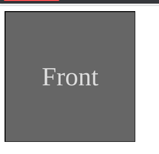
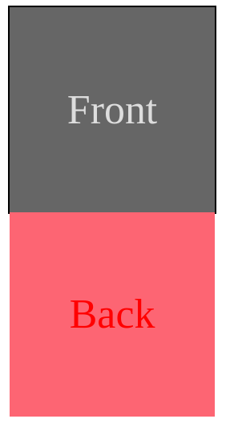
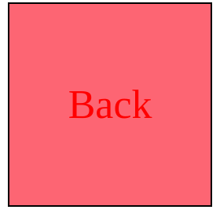
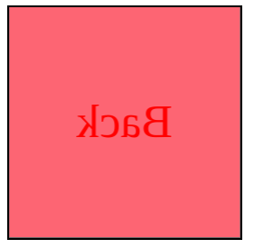
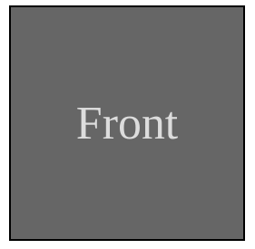
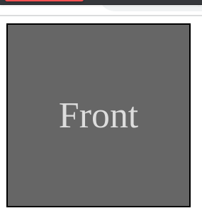
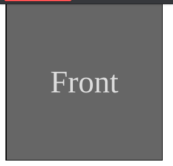
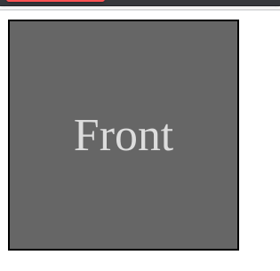

本篇參考[W3School:How TO — Flip Card](https://www.w3schools.com/howto/howto_css_flip_card.asp)，因為看他的例子有點看不太懂，想自己試試看把它寫出來。

### 事前準備

翻牌的概念是使用一個 `<div class="card">` 包住另外兩個 `<div>` ：`<div class="front">` 、`<div class="back">` ，並把`<div class="back">` 隱藏在卡片的後面，翻排時轉出背面並隱藏正面。

但是單純只有兩層的話卡片會翻不動，在card和正反兩面當中還需要一個 容器`<div class="flip-card-container">` 當作中間的媒介把正反面包起來，實際上在翻轉的時候card不會變動，實際翻轉的是中間的容器。

HTML如下：

```html
<div class="card"> <!--卡片最外層-->  
  <div class="flip-card-container"><!--包裝卡片正反面的容器-->  
    <div class="front"><!--卡片正面-->  
      Front  
    </div>  
    <div class="back"><!--卡片反面-->  
      Back  
    </div>  
  </div>  
</div>
```

CSS如下(僅須設定每個div的height和width即可，其他設定是方便呈現)：

```css
.card{  
  /*box-model*/  
  height: 200px;  
  width:200px;  
}  
.flip-card-container {  
  /*box-model*/  
  height:100%;  
  width: 100%;  
  box-sizing: border-box;  
  /*style*/  
  border: black solid 2px;  
}  
  
.front, .back{  
  /*display*/  
  display: flex;  
  justify-content: center;  
  align-items: center;  
  /*box-model*/  
  height:100%;  
  width:100%;  
}  
.front{  
  /*style*/  
  font-size: 40px;  
  background-color: #666666;  
  color: #dddddd;  
}  
  
.back{  
  /*style*/  
  background-color: #f27777;  
  font-size: 40px;  
  color: #f70707;  
}  
``` 
  

呈現出來的畫面如下：



### 翻轉設定

#### Position

為了要把卡牌背面塞到card裡面，需要添加 `position:absolute` 的設定，讓背面和container的左上角對齊（當牌翻轉之後正面會被藏起來，因此也需要 `position:absolute`），要讓 `absolute` 屬性生效，container裡面也需要使用有 `position` ，因此添加 `position:relative` 在container裡面。

CSS如下（可以寫在原本的css項目裡，或是另外再寫一次也可以）：

```css
/*for flip card*/  
.flip-card-container{  
  /*position*/  
  position: relative;  
}  
  
.front{  
  /*Position*/  
  position: absolute;  
}  
  
.back{  
  /*Position*/  
  position: absolute;  
}
```



#### transform與backface-visibility

把Back藏到背面去可以分成兩步驟

*   水平翻轉180度
*   畫面不要呈現給我們看

水平翻轉180度可以使用 `transform: rotateY(180deg)` 來達到效果

```css
.back{  
  transform: rotateY(180deg);  
}
```



接著我們要讓轉到背面的牌面被蓋起來不讓我們看到，我們需要使用 `backface-visibility:hidden` ，它可以把應該要放在背部的物件消失不讓我們看到。另外front也要加上這個屬性，因為當翻牌之後front也會被壓在下面，我們也要讓front不要顯示給我們看。


```css
.front{  
  /*Flip Card*/  
  backface-visibility: hidden;  
}  
  
.back{  
  /*Flip Card*/  
  backface-visibility: hidden;  
}
```
畫面如下：



#### 翻轉卡牌

我們這邊先採用hover的方法來驅動卡牌翻轉，概念是當滑鼠一到card的時候，container就會Y軸翻轉180度，把back翻到正面，front轉到背面。

```css
.card:hover .flip-card-container{  
  transform: rotateY(180deg);  
}
```



背面轉不出來的原因是因為現在是平面呈現，我們需要將它改為3D呈現，就可以把背面的物件顯示在上層。只需要在container中加上 `transform-style:preserve-3d` 就可以達到這個效果。

```css
.flip-card-container{  
  
  /*flip card*/  
  transform-style: preserve-3d;  
}
```



但是這樣單純更換正反內容很不好看，這個時候只要在container加上 `transition: transform 0.8s` 就可以讓整個翻轉畫面在0.8秒內呈現出來。另外還可以在card上面增加 `perspective` 屬性，讓使用者與物件感覺上有一些距離，翻轉動畫更立體。

```css
.card {  
  perspective: 1000px; /* Remove this if you don't want the 3D effect */  
}  
.flip-card-container{  
  /*flip card*/  
  transition: transform 0.8s;  
}
```


#### 全部的CSS


```css
.card{  
  /*box-model*/  
  height: 200px;  
  width:200px;  
}  
.flip-card-container {  
  /*box-model*/  
  height:100%;  
  width: 100%;  
  box-sizing: border-box;  
  /*style*/  
  border: black solid 2px;  
}  
  
.front, .back{  
  /*display*/  
  display: flex;  
  justify-content: center;  
  align-items: center;  
  /*box-model*/  
  height:100%;  
  width:100%;  
}  
.front{  
  /*style*/  
  font-size: 40px;  
  background-color: #666666;  
  color: #dddddd;  
}  
  
.back{  
  /*style*/  
  background-color: #f27777;  
  font-size: 40px;  
  color: #f70707;  
}  
  
  
/*for flip card*/  
.card{  
  perspective: 1000px; /* Remove this if you don't want the 3D effect */  
}  
.flip-card-container{  
  /*position*/  
  position: relative;  
  /*flip card*/  
  transition: transform 0.8s;  
  transform-style: preserve-3d;  
}  
.card:hover .flip-card-container{  
  transform: rotateY(180deg);  
}  
.front{  
  /*Position*/  
  position: absolute;  
  /*Flip Card*/  
  backface-visibility: hidden;  
}  
  
.back{  
  /*Position*/  
  position: absolute;  
  /*Flip Card*/  
  transform: rotateY(180deg);  
  backface-visibility: hidden;  
}
```

### 使用Click來驅動翻轉效果

有的情況下會想使用點擊來翻牌，這個時候可以利用addEventListenr監聽器來實做，當card被點擊的時候，我們幫container增加一個新的 `flip` 的class，並在class出現的時候翻卡片。

以下的CSS先註解或刪除：

```css
.card:hover .flip-card-container{  
  transform: rotateY(180deg);  
}
```

並增加以下CSS

```css
.flip-card{  
  transform: rotateY(180deg);  
}
```

增加以下JavaScript，在card身上加裝click EventListener，當card被點擊的後就會驅動flipCard，並找到event.currentTarget（就是安裝EventListener的物件，也就是card）下面的container，去toggle `flip-card`這個class( `toggle()` 可以讓class按一下出現，再按一下消失）

```javascript
function flipCard(event) {  
  const flipCardContainer = event.currentTarget.querySelector(".flip-card-container")  
  flipCardContainer.classList.toggle("flip-card")  
}  
const card = document.querySelector(".card")  
card.addEventListener("click",event=>flipCard(event))
```

畫面呈現如下：



### 結語

之前看W3School的時候一直搞不懂翻牌的原理，現在終於懂了，也謝謝閱讀到這邊的您！