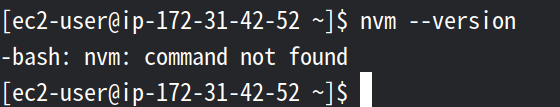
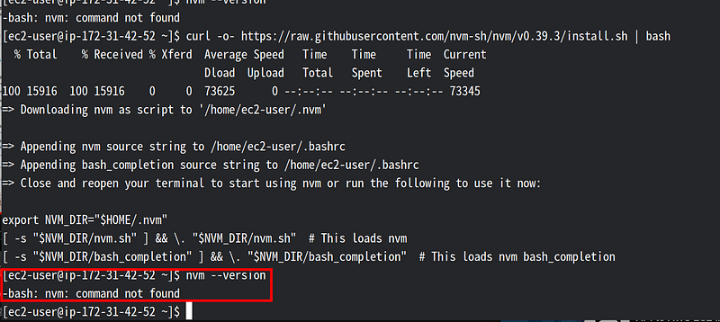

### 簡介

大家好我是Murky，最近在嘗試將我的Node.js+MongoDB的專案推上AWS EC2，想把我上傳成功的經驗與途中採過的坑跟大家分享。

以下的操作過程都是按照 “[AWS EC2 with Node.js and MongoDB](https://www.youtube.com/watch?v=7vf210p2tJg)”這部教學執行，另外我是一個超級新手加上超不會寫文章，以下可能很多不合理的地方先向您致歉＠＠。

### 目錄

⊙ [本文的限制](#c2eb)  
⊙ [本次使用的專案](#b53d)  
-------------------------------  
⊙ [註冊AWS帳號並前往EC2](#43d9)  
⊙ [建立EC2執行個體](#a4ab)  
⊙ [連線EC2](#e8ff)  
⊙ [安裝NVM與Node.js](#f00f)  
⊙ [更改PORT](#017f)  
⊙ [安裝MongoDB](#6050)  
⊙ 使[用FileZilla上傳檔案](#1780)  
⊙ [啟動APP](#96f1)  
⊙ [安裝PM2](#2a67)  
⊙ [結語](#f973)

### 本文的限制

由於我還不太熟悉AWS，很多技術障礙我還找不到排除的方法，直接欠技術債並找方法繞過去，所以請先閱讀以下的限制，確認本文是否符合您的需要。

*   使用FileZilla上傳程式，未使用eb
*   僅能使用Node.js 18版以前的版本（不包含18版）
*   僅能使用Amazon Linux 2 不能使用Amazon Linux 2023
*   使用AWS Root帳號操作
*   使用Bash指令操作

### 本次使用的專案

本文使用我自己寫的專案： [記帳網站-我的私房錢](https://tinymurky.medium.com/%E5%B0%88%E6%A1%88-%E8%A8%98%E5%B8%B3%E7%B6%B2%E7%AB%99-%E6%88%91%E7%9A%84%E7%A7%81%E6%88%BF%E9%8C%A2-5ec064eab541) ，此專案是由Node.js+MongoDB製作的簡單專案。

本專案使用幾個環境變數放於專案根目錄的 `.env`檔案中，以下四個環境目錄是比較重要需要依照您的狀況設定的。

```shell
MONGODB_URL=mongodb://127.0.0.1:27017/expense-tracker  
PORT=3000  
GITHUB_CALLBACK='http://ec2-35-78-73-49.ap-northeast-1.compute.amazonaws.com/auth/github/callback'  
GOOGLE_CALLBACK='http://ec2-35-78-73-49.ap-northeast-1.compute.amazonaws.com/auth/google/callback'
```
1.  MONGODB_URL:   
    您的專案在尚未上傳前，請先確定MongoDB可以連線到你本地安裝的[MongoDB Community Server](https://www.mongodb.com/try/download/community)，也就是 `127.0.0.1:27017` 這個port，因為我是直接在AWS EC2裡面安裝MongoDB並直接由Node.js的Mongoose套件連線到MongoDB
2.  PORT:  
    您的專案設定監聽的Port可以自由設定，我是設為 `3000` ，並從http的 `PORT 80`forward到 `PORT 3000`
3.  第三方程式登入的callback:  
    如果您有使用第三方程式登入的套件如 `Passport` ，請於上傳前更改callback網址，必須要設定成EC2主機的位置，如:

```url
http://ec2-35-78-73-49.ap-northeast-1.compute.amazonaws.com/
```
以下正文開始！

### 註冊AWS帳號並前往EC2

請先到[Amazom AWS](https://signin.aws.amazon.com/signin?redirect_uri=https%3A%2F%2Fconsole.aws.amazon.com%2Fconsole%2Fhome%3FhashArgs%3D%2523%26isauthcode%3Dtrue%26nc2%3Dh_ct%26src%3Dheader-signin%26state%3DhashArgsFromTB_ap-southeast-2_37d9a7514f067d13&client_id=arn%3Aaws%3Asignin%3A%3A%3Aconsole%2Fcanvas&forceMobileApp=0&code_challenge=UGxP5r6iOjifP4jXlT9Sgmy57qYVoZpMay4tNyGy7_g&code_challenge_method=SHA-256)網站註冊一個帳號，我們需要使用AWS Root帳號


註冊好Root帳號之後登入，並於搜尋欄位上方輸入EC2並點擊進入


進入後右上角選擇EC2要建立的位置，我選擇離台灣比較進的東京


### 建立EC2執行個體

接著要開始建立EC2的主機

#### 選擇主機

點選左方的EC2儀表板，點選中間的啟動執行個體。


幫主機取名字，並選擇**Amazon Linux**作為我們的主機


往下選擇Amazon Machine Image，請一定要選擇**Amazon Linux 2**，不要選Amazon Linux 2023，因為目前MongoDB尚未支援Amazon Linux 2023，等等會裝不起來。


#### 新增金鑰對

往下繼續到金鑰對設定，假設您沒有任何金鑰，我們先按右邊的「建立新的金鑰對」


幫金鑰對取一個名字，類型選擇 `RSA` ，私有檔案格式選擇 `.pem` ，等一下會使用FileZilla對EC2進行SSH連線。完成後點選右下角建立金鑰對。


點選建立金鑰對後就會下載 `.pem` 金鑰，將它放在我們的專案底下


#### 進行網路設定

進入網路設定，可以直接將下面的選項打勾，然猴按右上角的編輯

1.  允許SSH流量
2.  允許來自網際網路的HTTP流量


進入編輯後先點選「建立安全群組」，並幫它取個名字與說明


如果前面有勾選HTTP，往下安全群組規則就會出現HTTP，如果沒有出現也可以自己新增，重點是要開啟 `PORT 22` 、 `PORT 80` ，來源類型都選擇隨處。

**注意**：SSH其實不應該選擇任何IP都可以存取，而是應該選擇您固定會使用的IP，但是我沒有固定IP所以先選「隨處」。


#### 設定儲存

最小儲存空間需要容下快照，所以選擇8 GiB。


以上都完成之後就按下送出。


### 連線EC2

建立好EC2之後我們要用本地的終端機直接連線到EC2。

於建立成功畫面點選右下角的檢視所有個體


點選剛剛建立的EC2


點選右上角的連線按鈕


點選上面的SSH用戶端，另外這邊提供的公有IP地址與使用名稱也可以先記起來，FileZilla連線會使用到。


下圖紅框內的指令為本地端終端機需要輸入的指令，幫我們連線到EC2


文字如下所示，另外因為我重複式了好幾次，所以每次的截圖的IP與網址可能會不一樣。

  
開啟 SSH 用戶端。  
尋找私有金鑰檔案。用於啟動此執行個體的金鑰是 ap-northeast-1-tokyo-AWS.pem  
如有必要，請執行此命令，以確保您的金鑰無法公開檢視。  
  
```shell
chmod 400 ap-northeast-1-tokyo-AWS.pem  
```
使用 公有 DNS 連線至執行個體：  
```shell
ec2–35–78–67–104.ap-northeast-1.compute.amazonaws.com  
```
  
範例：  
```shell
ssh -i "ap-northeast-1-tokyo-AWS.pem" ec2-user@ec2–35–78–67–104.ap-northeast-1.compute.amazonaws.com
```

打開終端機，cd 進入專案資料夾（或是你存放金鑰的位置），將第一道指令輸入。


輸入SSH連線指令，連線完成會出現Amazon Linux 2 的圖案（以下圖案是錯的，我選成Amazon Linux 2023）

它會詢問是否要連接此機器，輸入Yes

```shell
ssh -i "ap-northeast-1-tokyo-AWS.pem" ec2-user@ec2–35–78–67–104.ap-northeast-1.compute.amazonaws.com
```


接著我們輸入以下指令，確保EC2裡面的所有Package都是最新的，我們就完成EC2的連線了。

```shell
sudo yum update -y
```


### 安裝NVM與Node.js

#### 安裝NVM

我們可以先輸入以下指令，發現EC2沒有安裝nvm

```shell
nvm --version
```



我們輸入以下指令安裝nvm，其中版本 `v0.39.3` 可以依照您的需要更改

```shell
curl -o- https://raw.githubusercontent.com/nvm-sh/nvm/v0.39.3/install.sh | bash
```

完成後我們再輸入一次 `nvm --version` 發現還是沒有安裝。



不要緊張，先於終端機中輸入 `exit` 離開EC2回到本機，再一次輸入SSH指令之後連回EC2，再輸入一次`nvm --version` ，可以看到版本。

```shell
ssh -i "ap-northeast-1-tokyo-AWS.pem" ec2-user@ec2–35–78–67–104.ap-northeast-1.compute.amazonaws.com
```


#### 安裝Node

使用以下指令安裝node，請務必使用18版以前（不含18版）的node.js。

```shell
nvm install 16.20.1
```

不要安裝18版的原因是因為，18版之後會需要以下兩個套件 `GLIBC_2.27` 、 `GLIBC_2.28` ，AWS提供的快照沒有以上兩個套件，會出現以下錯誤。

```shell
node: /lib64/libm.so.6: version `GLIBC_2.27' not found (required by node)  
node: /lib64/libc.so.6: version `GLIBC_2.28' not found (required by node)
```

我們可以嘗試自己更新這兩個套件，可以參考文章：[node: /lib64/libm.so.6: version `GLIBC_2.27' not found](https://www.cnblogs.com/dingshaohua/p/17103654.html)

但由於更新需要更新版的 `GCC` 與 `make` 套件，我裝不起來，所以這邊就被我先跳過了。


### 更改Port

如果您跟我一樣專案是設定監聽 http `PORT 80` 以外的port，可以使用以下指令將`PORT 80` 的請求forward 到您使用的port。

首先我們要安裝 `iptables` 套件

```shell
sudo yum install iptables
```

然後輸入以下指令可以把`PORT 80` forward到`PORT 3000`

```shell
sudo iptables -t nat -A PREROUTING -p tcp --dport 80 -j REDIRECT --to-ports 3000
```

### 安裝MongoDB

接下來這邊會比較痛苦一點

注意：如果任何一個步驟安裝失敗  
可以輸入以下指令後再全部從頭操作

```shell
sudo rm -rf /etc/yum.repos.d/mongod*  
sudo yum clean all
```

我們要先於EC2連線狀態下CD進入以下資料夾

```shell
cd /etc/yum.repos.d
```

新增一個檔案，依照您想使用的mongoDB的版本輸入檔名（於撰文當下官網推薦使用6.0）

```shell
sudo touch mongodb-org-6.0.repo
```

接著前往[[MongoDB的官網](https://www.mongodb.com/docs/manual/tutorial/install-mongodb-on-amazon/)]

點選上面的Resources => Server


選擇左邊的左邊選Install MongoDB Community Edition => install on linux => install on Amazon


並往下拉動，看到需要放至於 `/etc/yum.repos.d/` 目錄下的 `mongodb-org-6.0.repo` 檔案的內容，複製以下內容。

另外這邊也是需要使用Amazon Linux 2 的原因，這段指令僅提供給Amazon Linux 2使用。


回到EC2的終端機，考驗vi操作功力的時間到了。

使用以下指令用vi操作剛剛新增的檔案

```shell
sudo vi mongodb-org-6.0.repo
```

現在我們進到了`mongodb-org-6.0.repo` 裡面，把剛剛複製的文字都貼進去。

```shell
[mongodb-org-6.0]  
name=MongoDB Repository  
baseurl=https://repo.mongodb.org/yum/amazon/2/mongodb-org/6.0/x86_64/  
gpgcheck=1  
enabled=1  
gpgkey=https://www.mongodb.org/static/pgp/server-6.0.asc
```

接著 按下 `ESC` 跳出vi的 insert mode，然後按下冒號 `:` 接著輸入 `wq` 按下 `enter`


使用以下指令可以看是否有存檔

```shell
cat mongodb-org-6.0.repo
```


執行以下指令安裝mongodb

```shell
sudo yum install -y mongodb-org
```


在啟動MongoDB前含需要於EC2根目錄建立 `/data` 與 `/data/db` 兩個資料夾。

```shell
cd /  
sudo mkdir data  
cd data  
sudo mkdir db
```

建立完成後別忘了回到ec2-user資料夾

```shell
cd /home/ec2-user
```

回到 `~` 資料夾後，我們終於可以啟動MongoDB了

```shell
sudo service mongod start
```
看到以下字樣代表成功啟動MongoDB!


#### 注意：

MongoDB在EC2裡面也是使用 `PORT 27017` 來進行連線，請卻人您的專案在您的電腦中已可以由以下環境設定連線到您本機的MongoDB ( `/expense-tracker` 是我的Database名稱，可以改成您的DB)

```shell
mongodb://127.0.0.1:27017/expense-tracker
```

### 使用FileZilla上傳檔案

接著就是逃課的部份，我使用FileZilla上傳檔案而不是用預設的eb

先由以下連結安裝FileZilla

*   [FileZilla for Linux](https://filezilla-project.org/download.php)
*   [FileZilla for windows](https://filezilla-project.org/download.php?platform=win64)

然後我們回到EC2執行個體的網頁，以下畫面中的公有IPv4或公有IPv4 DNS可以用來執行SSH連線，複製後點擊右上角的連線。


進入連線之後可以看到使用者名稱，預設都是 `ec2-user`


到FileZilla按左上角的開啟站台管理員


進入以下畫面後點選新站台，依照以下條件輸入

*   協定：SFTP
*   主機：公有IPv4或公有IPv4 DNS
*   登入方式：金鑰檔案
*   使用者：ec2-user
*   金鑰檔案：放置從AWS下載的金鑰


把專案裡面除了 `/node_modules` 和 `/README.md`等以外的檔案全部都上傳到 `ec2-user` 資料夾，方法為選擇後右鍵點上傳（我不小心把`/node_modules`也上傳上去了）


### 啟動APP

我們先用以下指令安裝所有需要的package

```shell
npm install
```

不曉得為什麼我的mongoose不會自動安裝，我們手動安裝

```shell
npm install mongoose
```

安裝完之後輸入以下指令安裝預設seed(我的專案有預設seed，您的不一定要有)

```shell
npm run seed
```

然後輸入以下指令啟動app

```shell
npm run start  
或是  
node app.js
```
如果這個時候成功跑起來了，將您的EC2 公有IPv4或公有IPv4 DNS 直接貼在瀏覽器網紙上就可以直接連到您的專案


### 安裝PM2

由於 `node app.js` 這個方法我們需要一直開著終端機，如果要關閉終端機之後繼續跑，需要安裝PM2，我們用以下指令安裝PM2

```shell
npm install pm2@latest --global
```

用以下指令看PM2有沒有裝好

```shell
pm2 -v
```


使用以下指令啟用app

```shell
pm2 start app.js
```


使用以下指令停用app

```shell
pm2 stop app.js
```


恭喜您！你已經成功把您的專案推到AWS上面了！

記得輸入 `exit` 來離開EC2

```shell
exit
```

### 結語

謝謝看這篇文章的您！希望這篇文章可以幫助您在使用AWS時少踩一些坑，我也在寫這篇文章的過程中學到了很多。