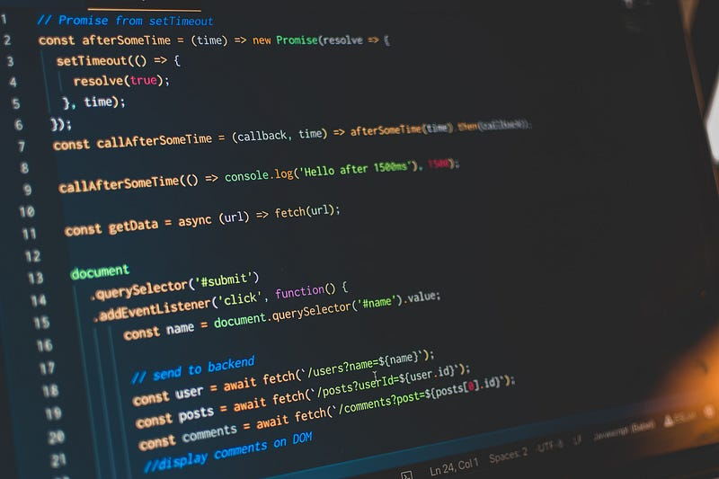
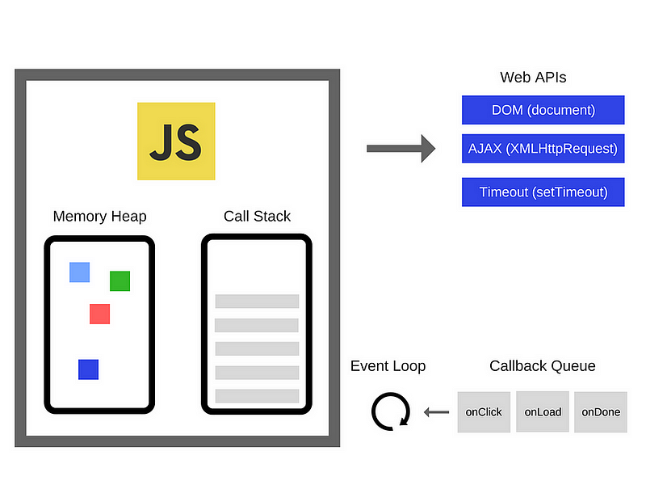
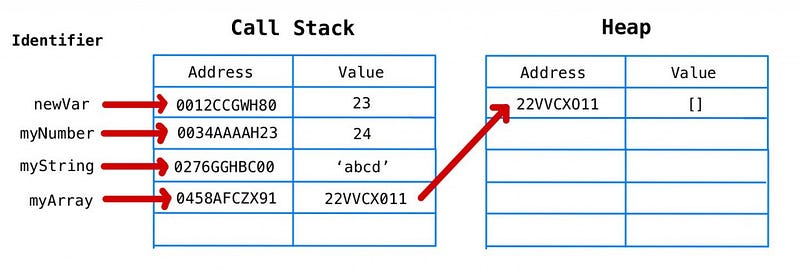
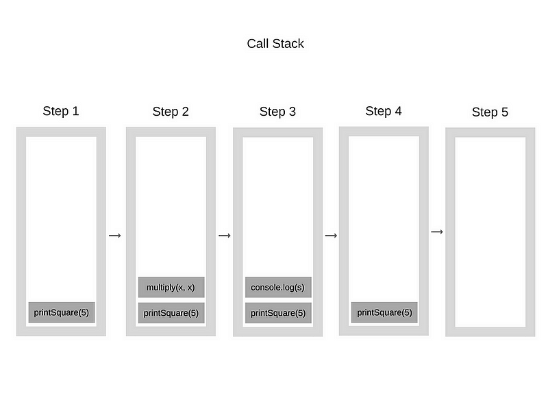
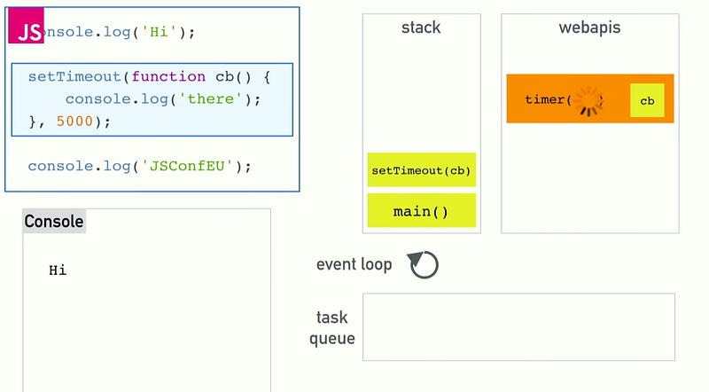

### 前言

最近開始看JavaScript的背景資料，瞬間被大量的知識淹沒。以下這部What the heck is the event loop anyway?被大量文章引用，因此想先從此影片入門。本文章為觀看以下影片的筆記，並夾雜一些其他文章的資訊，主要筆記內容為JavaScript的Call Stack, Callback, Event Loop的運作方式。

<iframe width="673" height="379" src="https://www.youtube.com/embed/8aGhZQkoFbQ?si=2-_Ixy18e-xbAmAC" title="YouTube video player" frameborder="0" allow="accelerometer; autoplay; clipboard-write; encrypted-media; gyroscope; picture-in-picture; web-share" allowfullscreen>
</iframe>

### JavaScript Engine

JavaScript 需要藉由JavaScript Engine來運作，最著名的是Chrome的V8引擎，其內容主要分為兩個部份：

*   Memory Heap - 紀錄Object形式資料的存放位置
*   Call Stack - 紀錄要執行的程式碼，stack形式儲存，從top開始執行

需要注意其他常見的網頁元素如DOM、SetTimeout、AJAX這些並不在JavaScript Engine裡面，而是由各家瀏覽器提供。



#### Memory Heap

JavaScript於執行時，如果是7種原始型態( `Null, Undefined, Boolean, Number, BigInt, String, Symbol` )，會直接把值存在Call Stack當中。如果是遇到Object則會僵直儲存於Memory Heap，再從Call Stack紀錄資料於Memory Heap中的位置。
```javascript
let myNumber = 23  
let newVar = myNumber  
myNumber += 1  
let myString = "abcd"  
let myArray = \[\]
```


#### Call Stack

Call Stack為一個儲存接下來要執行的程式碼的Stack，每個要執行的程式碼都會從Stack上方Push到Stack裡面，所以越晚被呼叫的程式碼則會在越上方。當呼叫完所有程式碼之後，便會從Stack最上層pop出一段程式碼執行，直到Stack變成空的。

以下方的程式碼為例，首先被呼叫的是 `printSquare(5)` ，接著是其中的 `multiply(x,x)` ，這兩個function先被push到Stack裡面，由於`multiply(x,x)` 裡面沒有其他的function所以開始執行，先從Stack中pop()出`multiply(x,x)` 執行，完成後發現`printSquare(5)` 裡面還有一個 `console.log(s)` ，所以要先push`console.log(s)` 進Stack後再pop出來執行，都完成後才會pop`printSquare(5)`

```javascript
function multiply(x, y) {  
    return x \* y;  
}  
  
function printSquare(x) {  
    var s = multiply(x, x);  
    console.log(s);  
}  
  
printSquare(5);
```


#### single-thread 單一執行序

JavaScript被稱作為single-thread language的原因是JavaScript僅依靠單一一個Call Stack來執行程式，所以它一次只能做一件事情。因此如果執行時中間安插一個很緩慢的程式，如對遠端伺服請求，就會卡住後面要執行程式。

像是下面這個程式碼要跑完while迴圈才會印出”This is so slow”

```javascript
console.log(1)  
let i = 0  
while (i<1000000){  
  i++  
}  
console.log("This is so slow")
```
### Asynchronous非同步

為了解決上述問題，瀏覽器提供Web API、Callback Queue（或是工作佇列（task queue））、Event Loop解決這個問題。

解決的方法是，如果遇到需要花很多時間執行的動作，可以使用Web APIs提供的方法執行，如DOM、SetTimeout、AJAX、EventListener等，當Call Stack遇到Web APIs時，pop Web APIs的程式碼出來，讓API到其他地方執行他的程式碼，API完成工作之後，會將結果放到Callback Queue裡面，並安插一Event Loop，當Call Stack完成之後，變從Callback Queue當中Dequeue一段程式碼出來執行。

這樣瀏覽器就可以把很慢的程式碼先放到一邊，等Call Stack空了之後再執行。

聽起來很混亂，用以下程式碼說明。

```javascript
console.log('Hi')  
setTimeout(function cb(){  
  console.log('there')  
},5000)  
console.log('JSConfeu')

//Return如下  
Hi  
JSConfeu   
there
```
1.  程式碼先執行 `console.log('Hi')` ，接著遇到 `setTimeout`
2.  `setTimeout` 是Web API，先從Call Stack中取出來，由Web API執行，Call Stack先執行下一行 `console.log("JSConfeu")`
3.  `setTimeout` 同時等待5秒鐘，完成之後將 `console.log('there')` 放到Callback Queue(task queue)
4.  Event Loop隨時檢查Call Stack是否為空值，如果是，從Callback Queue取出(稱作Dequeue)`console.log("JSConfeu")` 後執行。



<iframe width="673" height="379" src="https://www.youtube.com/embed/8aGhZQkoFbQ?si=ESrrHIn__k0qNC81&amp;start=775" title="YouTube video player" frameborder="0" allow="accelerometer; autoplay; clipboard-write; encrypted-media; gyroscope; picture-in-picture; web-share" allowfullscreen></iframe>

但如果 `setTimeout` 改成0秒執行呢？結果仍和會是一樣，`setTimeout`內的程式碼會放在最後執行。

這是因為使用Web APIs時已經將程式碼pop出Call Stack，並放到Callback Queue裡面，而Callback Queue裡面的程式碼需要等到Call Stack都執行完才能push進Call Stack，因此最後執行。
```javascript
console.log('Hi')  
setTimeout(function cb(){  
  console.log('there')  
},0) //0秒執行  
console.log('JSConfeu')

//Return如下  
Hi  
JSConfeu   
there
```
#### Callback Queue

Callback Queue或稱Task Queue，他是一個先進先出的資料結構Queue，當Web APIs處理完程式碼之後，會Enqueue進入Queue的最後面，當Call Stack清空之後，Callback Queue會從最前端取出(dequeue)一段程式碼進入Call Stack。

#### Event Loop

Event Loop是一個不斷Check Call Stack是否清空的While Loop。常如下實做。
```javascript
while (queue.waitForMessage()) {  
  queue.processNextMessage();  
}
```
當沒有任何訊息時，`queue.waitForMessage` 會同步地等待新訊息到來。

### Asynchronous Function對畫面渲染的影響

檢視以下程式碼，分別為Synchronous與Asynchronous的迴圈，Synchronous迴圈要將迴圈內所有物件都跑過一遍才能進入下一段程式碼，Asynchronous迴圈則是產生多個Task 進入Callback Queue，等到Call Stack結束才執行。

一般Synchronous會比Asynchronous快，但如果每個迴圈要執行的內容本身太慢，則會擠住後面的程式碼，因此使用Asynchronous迴圈可以先給後面的程式先執行。

而瀏覽器在渲染畫面的時候是使用和Callback Queue類似的Render Queue，它一樣是在Call Stack被清空時才能使用。

如果使用Synchronous迴圈會導致畫面須等到迴圈結束才能渲染。而Asynchronous迴圈則可以讓畫面在每個Task dequeue的時候進行渲染。
```javascript
// Synchronous  
\[1, 2, 3, 4\].forEach(function (i) {  
  console.log(i)  
  delay()  
})  
  
// Asynchronous  
function asyncForEach(array, cb) {  
  array.forEach(function () {  
    setTimeout(cb, 0)  
  })  
}  
  
asyncForEach(\[1, 2, 3, 4\], function (i) {  
  console.log(i)  
  delay()  
})

<iframe width="673" height="379" src="https://www.youtube.com/embed/U3Q6Ctid87U?si=VYRFvjWB9sGhzk3n" title="YouTube video player" frameborder="0" allow="accelerometer; autoplay; clipboard-write; encrypted-media; gyroscope; picture-in-picture; web-share" allowfullscreen></iframe>

```
### 結語

經過一段掙扎之後終於把影片內容整理出來，也謝謝看到這邊的您，如果內容有錯請跟我說一下，我會盡快修改。

### 參考來源

*   [What the heck is the event loop anyway?](https://www.youtube.com/watch?v=8aGhZQkoFbQ)
*   [How JavaScript works: an overview of the engine, the runtime, and the call stack](https://medium.com/sessionstack-blog/how-does-javascript-actually-work-part-1-b0bacc073cf)
*   [為了轉生而點技能-JavaScript，day7 (原始型態與物件型態在記憶體上的變化](https://ithelp.ithome.com.tw/articles/10282815)
*   [\[筆記\] 理解 JavaScript 中的事件循環、堆疊、佇列和併發模式（Learn event loop, stack, queue, and concurrency mode of JavaScript in depth）](https://pjchender.blogspot.com/2017/08/javascript-learn-event-loop-stack-queue.html)
*   [\[筆記\] 不同execution context的變項不會互相影響─瞭解function背後運作的邏輯](https://pjchender.blogspot.com/2015/12/execution-context.html)
*   [\[筆記\] 認識同步與非同步 — Callback + Promise + Async/Await](https://medium.com/%E9%BA%A5%E5%85%8B%E7%9A%84%E5%8D%8A%E8%B7%AF%E5%87%BA%E5%AE%B6%E7%AD%86%E8%A8%98/%E5%BF%83%E5%BE%97-%E8%AA%8D%E8%AD%98%E5%90%8C%E6%AD%A5%E8%88%87%E9%9D%9E%E5%90%8C%E6%AD%A5-callback-promise-async-await-640ea491ea64)
*   [mozilla.org：並行模型和事件循環](https://developer.mozilla.org/zh-TW/docs/Web/JavaScript/Event_loop)