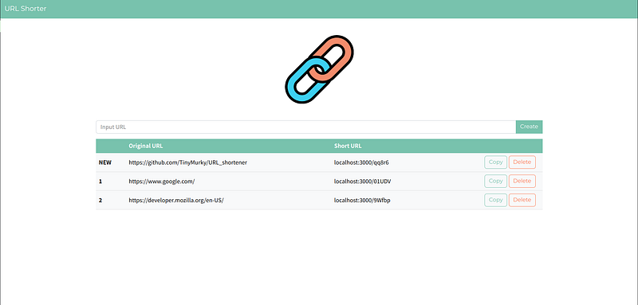
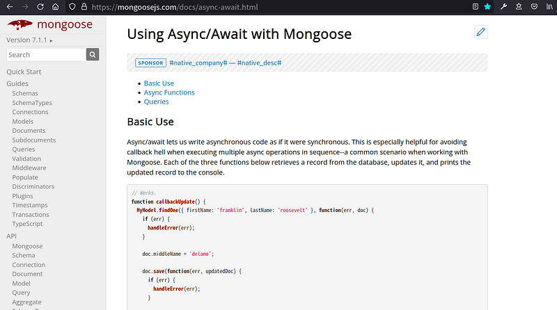

### 前言

最近在撰寫可以將往只縮短成短網址的專案（[github:TinyMurky/URL_shortener](https://github.com/TinyMurky/URL_shortener)）。其中MongoDB需要使用套件mongoose操作，而mongoose多數語法是由Promise組成，然而Promise寫法很容易變成Callback Hell，讓程式碼難以維護與使用。

### Promise 撞牆經驗

在縮短網址這份專案當中，需要有一個function檢查原始網址是不是已經被縮短過了，如果曾建立過則回傳以前建立過的短網址，未建立過則建立一筆新的短網址資料後，並回傳建立好的短網址提供前端畫面渲染。

然而mongoose套件使用Promise語法，如果在Promise語法中要回傳值給Function之外，需要使用 `resolve()` 並 `return new Promise()` 物件，而我又疊了兩層，整段程式碼如下方呈現的樣子變成了Callback Hell。

另外我嘗試想寫error handling，發現在Promise語法下，不僅要在個Promise物件後使用 `catch` ，在 `resolve()` 還需要外掛 `try and error` ，讓程式碼更長更難懂(結果我還是catch不到error)

```javascript
export function createShortURL(origin_URL) {  
  return new Promise((resolve, reject) => {  
    resolve(  
      shortURL  
        .find({ origin_URL: origin_URL })  
        .lean()  
        .then((URL) => {  
          if (URL.length) {  
            return URL[0]  
          } else {  
            return new Promise((resolve, reject) => {  
              resolve(  
                randomID().then((newID) => {  
                  const newURLConfig = { _id: newID, origin_URL: origin_URL }  
                  const newShortURL = new shortURL(newURLConfig)  
                  newShortURL.save()  
                  return new Promise((resolve, reject) => {  
                    resolve(newURLConfig)  
                  })  
                })  
              )  
            })  
          }  
        })  
    )  
  })  
}
```
### 尋找Mongoose的Async寫法



為了避免Callback Hell，我想使用async/await的語法，結果mongoose官網已經有[async寫法教學](https://mongoosejs.com/docs/async-await.html) 了。跟著教學我把上面那段很醜的的程式碼改寫成下方比較容易閱讀的版本，並且可以直接把 `save()` 的Promise物件回傳。

另外直接把function內的程式碼用 `try` 包起來就可以簡單catch到error。
```javascript
export async function createShortURL(origin_URL) {  
  try {  
    const urlArray = await shortURL.find({ origin_URL })  
    if (urlArray.length) {  
      urlArray[0].set("updatedAt", new Date())  
      return urlArray[0].save()  
    } else {  
      const newID = await randomID()  
      const newURLConfig = {  
        _id: newID,  
        origin_URL: origin_URL,  
      }  
      const newShortURL = new shortURL(newURLConfig)  
      return newShortURL.save()  
    }  
  } catch (error) {  
    throw Error(error)  
  }  
}
```
### 結語

不好意思這篇有一點短，我想提醒自己的是以後遇到Promise盡量用async/await改寫，並且多花心思在官方文件上，裡面常常會有答案。